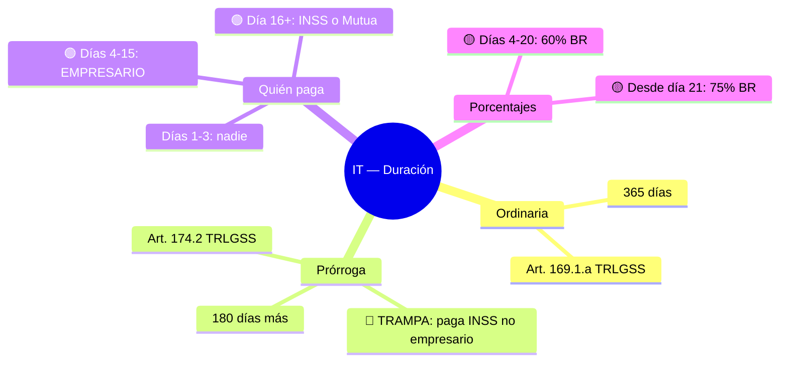

# 🧠 OPOS-WIKI: Plan Definitivo v3 — Sistema Completo
**Fecha:** 16-04-2026 | **Revisión:** v3 — Nomenclatura propia + arquitectura técnica completa  
**Modelo de negocio:** Comercial (SaaS web app)  
**Fuente primaria:** BOE (dominio público, Art. 13 LPI)

---

> ## 🔄 ACTUALIZACIÓN 17/04/2026 20:15 — Revisión v3.1
>
> Este documento **sigue vigente** como plan comercial SaaS, pero tras la sesión del 17/04 hay precisiones importantes:
>
> ### 📎 Documentos complementarios nuevos (léelos antes de implementar)
>
> 1. **`/home/spas/OPOS_GEMINI_1/17_04_26_ESTRATEGIA_EXTRACCION_SABIDURIA.md`** — estrategia detallada de extracción (Camino C), 9 patrones DM, pipeline 5 fases, cómo la wiki recuerda sin MCP Memory.
> 2. **`/home/spas/OPOS_GEMINI_1/academias/1_casos_recientes_2026_DM/temario_troceado/PLAN_CLD+_OBCIDIAN_AL.md`** — plan técnico Obsidian v3 (arquitectura vault, plugins, skills, roadmap 3 sesiones).
>
> ### ✅ Decisiones CONFIRMADAS que afinan este plan
>
> - **BD vectorial**: Neo4j único (Qdrant descartado definitivamente) — 103 leyes + 4.742 preceptos + 6.334 embeddings pabloSI ya operativos.
> - **Muro de Abstracción**: simplificado de "arquitectura obligatoria" a **1 línea en el prompt**. Justificación: Neo4j solo contiene BOE + nuestros análisis; la IA nunca recibe materiales de academia.
> - **Memoria del usuario**: va al vault markdown (no MCP Memory). Cada sesión = 1 `.md` nuevo que la IA lee en la siguiente sesión.
> - **Calculadoras**: **60+ reales** (no 55 ni 64 de versiones antiguas). `calculos_ss_extended.py` (83KB, 30+ funciones) + `calculadora_age.py` (46KB, 30+ funciones). **¡Las trampas ya están codificadas en docstrings (G4/H7/I12)!**
> - **Frontend**: 17 vistas React operativas. **NO se duplica con la wiki**. La wiki es complemento (estudio personal + extracción de conocimiento).
> - **Plugins Obsidian**: 4 esenciales (Syncthing Integration, Spaced Repetition, Excalidraw, Dataview). Resto opcional/descartado.
> - **Sync**: Syncthing (gratis) ya instalado por el usuario.
>
> ### 🔍 Descubrimiento clave (video 2 de `_video_subs.md`)
>
> La wiki **crece con cada interacción** guardando `qa/YYYY-MM-DD-tema.md` con wikilinks. La IA al inicio de cada sesión LEE `usuarios/spas/perfil.md` + últimas notas Q&A → ya tiene contexto. Sin base de datos, sin MCP Memory.
>
> ### 🎭 9 patrones narrativos DM identificados (ver doc estrategia §3.3)
>
> 1. Red de personajes (4-6 actores) · 2. Conflictos cruzados · 3. Salto de régimen · 4. Narrativa evolutiva · 5. Trampa de parentesco · 6. Relleno inteligente · 7. Vuelco 15 días · 8. Numeración desordenada · 9. Errores tipográficos del preparador.
>
> ### ⏭️ Siguiente paso operativo
>
> Cuando autorices: Cascade ejecuta **Sesión 1** del roadmap v3 → crea `backend/scripts/seed_obsidian_vault.py` → parsea Neo4j + YAMLs + docstrings → genera ~350 notas iniciales.

---

## ÍNDICE
1. [Marco Legal](#marco-legal)
2. [Nomenclatura Propia del Sistema](#nomenclatura)
3. [Los 5 Pilares Pedagógicos](#pilares)
4. [Arquitectura COSM](#cosm)
5. [Estrategia de IA](#ia)
6. [Motor de Flashcards: Anki vs App Propia](#flashcards)
7. [Presentaciones PPTX con Kimi/python-pptx](#pptx)
8. [DM completo vs Valera vs OPOS-WIKI](#comparativa)
9. [Plan de Ejecución](#ejecucion)
10. [Riesgos y Mitigaciones](#riesgos)
11. [Inventario de Activos Visuales (Pendientes)](#activos)


---

## 1. MARCO LEGAL {#marco-legal}

### ¿Es legal crear esta wiki y venderla?

**SÍ. Fundamentación:**

**Art. 13 LPI (RDL 1/1996):** Las disposiciones legales y reglamentarias publicadas en el BOE son dominio público. Nadie tiene derechos sobre el contenido del TRLGSS, la LPAC, la CE, etc.

**Lo que NO está protegido (puedes usar libremente):**
- Datos legales: plazos, porcentajes, artículos, sujetos obligados
- Estructura que impone la propia ley (cualquiera organizaría IT bajo el TRLGSS igual)
- Conocimiento pedagógico general (la idea de "hay una trampa aquí" no tiene dueño)
- Preguntas de exámenes oficiales reales (publicadas por el Ministerio → dominio público)
- Valores oficiales: SMI, PNC, bases de cotización (son datos del BOE/Ministerio)

**Lo que SÍ está protegido de las academias:**
- La redacción concreta de sus explicaciones
- El diseño visual exacto de sus esquemas (colores, distribución)
- Sus personajes ficticios (Silvia Pastor, Fernando Alcatraz...)
- La formulación literal de sus preguntas de test
- Su secuencia pedagógica específica (si es original)

### El "Muro de Abstracción" — garantía de independencia

```
FASE ANÁLISIS (materiales de terceros → solo como mapa de calor)
  Qué extraemos: qué artículos son importantes, qué tipo de trampas existen,
                 qué formato tiene el examen, qué actualizaciones son críticas
                 
═══════════════════════ MURO ═════════════════════════

FASE CREACIÓN (solo BOE + IA propia)
  Qué producimos: texto propio, diseño propio, ejemplos inventados, orden propio
```

**Regla práctica:** Si pudieras crear el mismo producto leyendo solo el BOE + el temario oficial de la convocatoria → es legal. El temario oficial ya dice qué estudiar; los materiales de academia solo te dicen cuánto peso darle a cada concepto.

### Riesgo residual: Competencia Desleal (Art. 11-12 LCD)

El riesgo real no es la PI sino la LCD si tu producto fuera reconocible como "copia" de DM o Valera.

**Mitigaciones incluidas en este plan:**
- Orden de temario completamente distinto (por flujo vital, no por temas)
- Nomenclatura propia para todo (ver sección 2)
- Diseño visual propio (Mermaid.js interactivo, no PDFs estáticos)
- Personajes propios en casos prácticos
- Consulta abogado PI antes de lanzar (~200-300€)

---

## 2. NOMENCLATURA PROPIA DEL SISTEMA {#nomenclatura}

> ⚠️ Estos nombres son PROPIOS. Ninguna academia los usa. No confunden con nadie.

| Término de origen | Nuestro nombre | Qué es |
|---|---|---|
| Cloze deletion | **"Hueco de Ley"** | Fill-in-the-blank en contexto legal |
| Spaced repetition | **"Repaso Inteligente"** | Algoritmo FSRS automático |
| Retention rate 90% | **"Curva de Dominio"** | Objetivo de retención por categoría |
| Mnemónico | **"Ancla de Memoria"** | Gancho mental para dato difícil |
| Versión Martina (Valera) | **"Mapa Legal"** | Mapa mental interactivo en Mermaid.js |
| Cuquifichas (Valera) | **"Fichas Vivas"** | Flashcards generadas desde BOE |
| 55 días por ley (Valera) | **"Ruta Adaptativa"** | Plan personalizado por IA según progreso |
| Progress dashboard | **"Radar de Progreso"** | Gráfico de araña por categorías |
| COSM (Create Once Serve Many) | **"COSM"** | Arquitectura de pregunta pre-verificada |
| Trampa nombrada (DM) | **"Señal de Trampa"** | Nombre propio para cada tipo de error |
| Test de 18 preguntas (DM) | **"Caso Vivo"** | Supuesto práctico de variables sustituibles |

---

## 3. LOS 5 PILARES PEDAGÓGICOS {#pilares}

### Pilar 1 — "AXIOMA" (la base legal verificada)

Cada concepto está anclado a su artículo BOE exacto. Triple verificación antes de publicar.

**Proceso:**
```
MCP-BOE extrae artículo consolidado vigente
    ↓
IA recibe el texto como contexto obligatorio (no de memoria)
    ↓
Genera explicación solo basada en ese texto, con citas
    ↓
Script verifica artículos mencionados en Neo4j
    ↓
Publicación con enlace al artículo BOE (el usuario puede verificar)
```

**Prompt anti-alucinación (base):**
```
"Lee el siguiente artículo del BOE.
1. Cuál es la norma general.
2. Qué excepciones existen (palabras: salvo, excepto, no obstante, salvo que).
3. Qué remisiones hace a otros artículos.
4. En qué se diferencia de lo que el estudiante esperaría intuitivamente.
5. Qué dato exacto confundirá al opositor.
Cita el número de artículo en cada afirmación.
Si no hay dato en el texto, escribe [VERIFICAR EN BOE]."
```

---

### Pilar 2 — "MAPA LEGAL" (visualización interactiva propia)

**Lo que diferencia al Mapa Legal del esquema Martina de Valera:**
| Aspecto | Martina (Valera) | Mapa Legal (OPOS-WIKI) |
|---|---|---|
| Formato | PDF estático impreso | Mermaid.js interactivo en web |
| Generado por | Diseñadora humana (Cinthia Moure) | IA desde JSON del artículo BOE |
| Actualización | Nueva edición (meses/años) | Automática cuando cambia el BOE |
| Integración | Ninguna con flashcard | Misma fuente JSON → Fichas Vivas |
| Audio | QR a grabación humana | Fase 2 (no ahora, coste elevado) |
| Estilo visual | Pastel orgánico | Colores semánticos propios del sistema |

**Sistema de colores propios:**
- 🔵 Azul → Plazos y tiempos
- 🔴 Rojo → Señal de Trampa (error común)
- 🟠 Naranja → Excepción o caso especial
- 🟢 Verde → Sujetos (quién hace qué)
- 🟡 Amarillo → Cuantías y porcentajes
- ⬜ Gris → Definición o concepto base

**Ejemplo de Mapa Legal (IT Duración):**


---

### Pilar 3 — "SEÑAL DE TRAMPA" (catálogo propio)

Cada trampa identificada recibe:
- **Nombre propio** (inventado, nunca copiado de ninguna academia)
- **Clasificación** por tipo: plazo / sujeto pagador / cuantía / excepción / remisión
- **Dificultad**: baja / media / alta
- **Artículo BOE** de referencia verificado
- **Ancla de Memoria** asociada

**Tipos de Señal de Trampa para SS:**

| Tipo | Ejemplo | Ancla de Memoria sugerida |
|---|---|---|
| **Trampa de sujeto** | "¿Quién paga IT días 4-15?" → Empresa, no INSS | "El jefe paga tu primera quincena enferma" |
| **Trampa de plazo** | Prórroga IT = 180 días (no 6 meses = 182/183) | "180 exactos, no seis meses" |
| **Trampa de porcentaje** | IT: 60% hasta día 20, 75% desde día 21 (no día 20) | "Veinte en sesenta, veintiuno en setenta y cinco" |
| **Trampa de excepción** | Gran incapacidad = complemento 45% (no prestación aparte) | "Gran = más porcentaje, no más prestación" |
| **Trampa de remisión** | RETA tiene reglas propias ≠ Régimen General | "Autónomo = otro mundo" |

---

### Pilar 4 — "FICHAS VIVAS" + REPASO INTELIGENTE (motor FSRS)

**¿Qué es un Hueco de Ley?**

Es una tarjeta con un dato crítico oculto. El estudiante RECUERDA activamente el dato en vez de leerlo pasivamente.

```
Ejemplo de Hueco de Ley simple:
  FRENTE: "La IT ordinaria dura máximo [___] días (Art. 169 TRLGSS)"
  DORSO: "365 días"

Ejemplo con múltiples huecos:
  "El Empresario paga la IT desde el día [___] hasta el día [___].
   A partir del día [___] paga el [___]."
  → Respuesta: 4 / 15 / 16 / INSS

Ejemplo de Señal de Trampa como Hueco:
  "TRAMPA: La prórroga de IT la paga el [___], NO el [___]"
  → Respuesta: INSS / Empresario
```

**La Curva de Dominio (objetivo 90%):**

El algoritmo FSRS programa cuándo mostrar cada tarjeta para que el usuario recuerde el 90% de lo estudiado en cualquier momento. No el 100% (imposible sin repasar todo cada día), sino el punto óptimo de equilibrio.

Visualización del Radar de Progreso:
```
         PLAZOS IT
              94% ✅
         /          \
  CÁLCULO BR        SUJETOS SS
    78% ⚠️             95% ✅
         \          /
          RECAUDACIÓN T5
              61% 🔴  ← Prioridad esta semana
```

---

### Pilar 5 — "RUTA ADAPTATIVA" (plan personalizado por IA)

**Sustituye al modelo de "55 días por ley" de Valera** (que es igual para todos).

La Ruta Adaptativa analiza:
- Velocidad de aprendizaje real del usuario (tarjetas por hora)
- Porcentaje de acierto por categoría
- Patrones de error (¿falla más a ciertas horas? ¿con ciertos tipos de pregunta?)
- Tiempo disponible declarado por el usuario
- Distancia a la fecha de examen

Y genera un plan diario realista:
```
📅 Tu plan para hoy (14/04/2026):
  🔴 Recaudación T5: 20 min — 8 Huecos de Ley (área crítica)
  🟡 Base Reguladora CC: 15 min — 5 Huecos de Ley (repaso programado)
  🟢 Plazos IT: 10 min — 3 Huecos de Ley (mantenimiento)
  📝 + 1 Caso Vivo de IT (simulacro 6 preguntas)
  ⏱️ Total: ~50 min
  
  A este ritmo: dominarás Recaudación T5 en ~8 días más.
```

> ⚠️ **Nota:** La Ruta Adaptativa es **Fase 2**. Para el MVP la prioridad es la calidad del contenido: Mapas Legales, Fichas Vivas y Casos Vivos verificados. La IA personalizada viene después cuando hay usuarios reales con datos reales.

---

## 4. ARQUITECTURA COSM {#cosm}

**COSM = Crear Una Vez, Servir Infinitas Veces**

### La base de datos de preguntas verificadas

```
BD COSM
├── Preguntas Parte A — General (CE, LPAC, LRJSP, TREBEP)
│   ├── ~500 preguntas verificadas contra BOE
│   ├── Tags: tema / subtema / tipo_trampa / dificultad / artículo
│   └── Cada pregunta: enunciado + respuesta_correcta + 3_distractores + justificación
│
├── Preguntas Parte B — SS Específico (TRLGSS y normas complementarias)
│   ├── ~800 preguntas verificadas contra BOE
│   └── Misma estructura de tags
│
├── Casos Base (supuestos prácticos)
│   ├── ~200 situaciones laborales tipo con variables sustituibles
│   ├── Variables: nombre / edad / tipo contrato / empresa / días cotizados /
│   │             contingencia / fecha baja / cuantías
│   └── Cada caso genera:
│       ├── 6-18 preguntas encadenadas sobre el mismo supuesto
│       └── Solución verificada con artículo BOE
│
└── Valores Oficiales 2026 (actualizados desde BOE)
    ├── SMI 2026
    ├── Pensión mínima y PNC: 8.803,20 €/año
    ├── Topes máximos y mínimos de cotización
    └── Cuantías IT, IP, jubilación mínimas
```

### La magia de las variables en los Casos Vivos

Un solo caso base con variables genera decenas de miles de combinaciones:
```yaml
caso_base: "IT_REGIMEN_GENERAL_001"
variables:
  nombre: [Pedro, María, Ahmed, Lucía, Javier, Sara, Carlos]  # 7
  sector: [construcción, hostelería, comercio, salud, industria] # 5
  días_cotizados: [180, 240, 365, 730, 1095]  # 5
  contingencia: [común, profesional]  # 2
  día_baja: [1, 4, 10, 16, 22, 30]  # 6
  empresa_tamaño: [<10 empleados, 10-50, >50]  # 3

Total variaciones matemáticas: 7×5×5×2×6×3 = 6.300 casos únicos
```

El opositor nunca repite el mismo supuesto.

### Generación de simulacros COSM

```
Simulacro Examen Real (proporción convocatoria):
  ├── 40 preguntas Parte A (algoritmo saca de BD_A según dificultad)
  └── 18 preguntas Parte B (1 Caso Vivo con variables aleatorias)

Simulacro Temático (práctica por área):
  └── 20 preguntas de "Jubilación" (todos los subtipos)

Simulacro Anti-trampa:
  └── 15 preguntas seleccionadas con Señal de Trampa marcada

Simulacro Personalizado (basado en Radar):
  └── Prioriza categorías por debajo del 90% en Curva de Dominio
```

---

## 5. ESTRATEGIA DE IA {#ia}

### Los dos problemas que la IA comete en derecho español

1. **Alucinación de artículos** — cita el Art. 170 cuando es el 169
2. **Mezcla de versiones** — aplica texto derogado porque su training data es viejo

### Solución: Arquitectura "BOE-first, IA-second"

```
El artículo PRIMERO. La IA DESPUÉS. Nunca al revés.

MCP-BOE → texto consolidado actual del artículo
    ↓
IA recibe el texto EXACTO como contexto forzado
    ↓
Prompt con restricciones: "Solo lo que dice este texto. Cita artículo."
    ↓
Post-proceso: script verifica artículos citados en Neo4j
    ↓
Publicación con enlace a BOE (verificable por el usuario)
```

### Qué modelo para cada tarea

| Tarea | Modelo | Por qué |
|---|---|---|
| Extracción JSON del artículo | **Gemini 2.0 Flash** | Rápido, barato, estructuración limpia |
| Explicación didáctica del artículo | **Claude Sonnet** | Menos alucinaciones, mejor razonamiento legal |
| Detección de Señales de Trampa | **Claude Sonnet** | Superior en "qué error cometerá alguien aquí" |
| Generación Mapa Legal (Mermaid) | **Claude Sonnet / Gemini Pro** | Ambos sólidos |
| Generación de Huecos de Ley | **Gemini Flash** | Tarea mecánica, coste mínimo |
| Chat de resolución de dudas | **Claude Sonnet** + RAG Neo4j | Con artículo verificado como contexto |
| Mezcla de simulacros COSM | **Script determinista** | No IA — selección algorítmica de BD |
| Ruta Adaptativa (Fase 2) | **Gemini Pro** | Análisis de patrones de usuario |

### Cómo capturar excepciones y matices legales

Las excepciones legales = 80% de las trampas en el examen.

**El prompt busca activamente las palabras trampa de la ley:**
```
"Busca en el artículo las siguientes palabras o equivalentes:
 'salvo', 'excepto', 'salvo que', 'no obstante', 'sin perjuicio',
 'a excepción de', 'podrá' (vs 'deberá'), 'hábiles' (vs 'naturales').
 Para cada una: explica qué excepción crea y por qué confundirá al opositor."
```

### Coste estimado de generación

| Volumen | Modelo | Coste estimado |
|---|---|---|
| 500 artículos → JSON estructurado | Gemini Flash | ~1-2€ |
| 500 artículos → Explicación didáctica | Claude Sonnet | ~5-10€ |
| 500 artículos → Mapa Legal Mermaid | Claude Sonnet | ~5-10€ |
| 500 artículos → 3 Huecos de Ley | Gemini Flash | ~0.5€ |
| **Total generación inicial** | | **~15-25€** |

Una vez generado y verificado: COSM. Sirves desde la BD, no regeneras.

---

## 6. MOTOR DE FLASHCARDS: ANKI VS APP PROPIA {#flashcards}

### El problema central

Si el usuario usa **Anki local**, la IA de tu app no puede:
- Explicar por qué falló una tarjeta
- Actualizar las tarjetas cuando cambia el BOE
- Alimentar el Radar de Progreso
- Calcular la Ruta Adaptativa

Si el usuario usa **tu web app**, tiene todo integrado pero necesita conexión.

### La solución híbrida

**NIVEL 1 — Motor FSRS en tu web app (EXPERIENCIA PRINCIPAL)**

```python
# Librería open source para integrar en backend Python
# https://github.com/open-spaced-repetition/py-fsrs
pip install fsrs

# Tu backend gestiona el horario de cada tarjeta por usuario
# La IA está conectada: falla → chat con artículo BOE
# El progreso alimenta el Radar de Progreso
# Actualización automática cuando cambia el BOE
```

**NIVEL 2 — Exportación a Anki `.apkg` (COMPLEMENTO OFFLINE)**

```python
# Librería open source para generar mazos Anki
# https://github.com/kerrickstaley/genanki
pip install genanki

# El usuario puede descargar el deck completo o por tema
# Estudia en el metro sin internet
# Desconectado de la IA (limitación asumida)
# Útil para el "pack de estudio" como producto secundario
```

**NIVEL 3 — App móvil propia (FASE FUTURA)**

```
= Lo mejor de ambos mundos: offline + IA + Radar de Progreso
= Tecnología: React Native o Flutter
= Fase 3, cuando haya ingresos y usuarios validados
```

### Alternativas a Anki evaluadas

| Herramienta | Open Source | FSRS | Integrable con IA | Veredicto |
|---|---|---|---|---|
| **py-fsrs** (tu backend) | ✅ | ✅ | ✅ Sí | ⭐ **Motor principal** |
| **Anki desktop** | ✅ | ✅ | ❌ No directo | Solo exportar .apkg |
| **Mochi Cards** | ❌ SaaS privado | Parcial | ❌ | Descartado (repo 404) |
| **Scholarsome** | ✅ | Básico | ❌ | No integrable |
| **Hashcards** | ✅ | ✅ FSRS | ❌ | Demasiado básico |
| **AnkiWeb** | Nube Anki | ✅ | ❌ | Descartado |

**Conclusión:** `py-fsrs` en tu backend + exportación `genanki` a `.apkg`. Ya está. No necesitas nada más.

---

## 7. PRESENTACIONES PPTX {#pptx}

### Evaluación de Kimi AI para PPTX

**Kimi (Moonshot AI)** genera presentaciones desde texto/PDF con exportación .pptx limpia y sin marca de agua.

**Valor pedagógico real:** SÍ existe:
- Repaso visual complementario al Mapa Legal
- Formato para compartir entre opositores (valor de comunidad)
- Base para vídeos explicativos en el futuro
- Posible producto secundario ("packs de diapositivas por tema")

**Problema:** Kimi no conoce el BOE. Necesitas darle el contenido ya procesado.

### Recomendación: python-pptx (no Kimi)

Para integrarlo con tu pipeline BOE → JSON → contenido verificado:

```python
# Librería open source, sin coste, sin dependencia externa
pip install python-pptx

# Pipeline: JSON del artículo BOE → python-pptx → .pptx
# = Estilo visual tuyo (colores del sistema)
# = Contenido verificado (viene del BOE)
# = Generación automática (100 artículos → 100 presentaciones)
# = Sin depender de ningún servicio externo
```

**Kimi puede servirte** para hacer la primera presentación de prueba y validar si el formato PPTX por tema tiene valor para ti como usuario. Para el producto final: `python-pptx` controlado.

---

## 8. DM COMPLETO VS VALERA VS OPOS-WIKI {#comparativa}

> ⚠️ **Corrección importante:** DM no es solo supuestos prácticos. Tiene cobertura completa.

| Característica | Valera | DM (completo) | OPOS-WIKI |
|---|---|---|---|
| Tests Parte A general (CE, LPAC...) | ✅ Muy fuerte | ✅ Cubre | ✅ COSM infinite mix |
| Tests Parte B SS específico | Débil | ✅ Muy fuerte | ✅ COSM infinite mix |
| Simulacros completos (partes 1+2) | Básico | ✅ Muy fuerte | ✅ COSM automático |
| Esquemas visuales | ✅ Martina (física) | ✅ Básicos | ✅ Mapa Legal (superior, dinámico) |
| Verificación BOE en respuestas | No | ✅ Cita artículo | ✅ Triple check automático |
| Actualización legislativa | Lenta (edición nueva) | Media | ✅ Tiempo real desde BOE |
| Flashcards / Repaso inteligente | Manual (Cuquifichas) | No | ✅ FSRS automático |
| Personalización de estudio | No | No | ✅ Ruta Adaptativa (Fase 2) |
| Chat de resolución de dudas | No | No | ✅ RAG + artículo BOE |
| Casos variables infinitos | No | Limitado | ✅ COSM (6.300+ por caso base) |
| Precio | ~225€/6 meses + libros | Similar | Por definir |
| Acceso offline | Libros físicos | Descargable | .apkg exportable |

**Ventaja diferencial real de OPOS-WIKI:** Ninguna academia puede actualizar en tiempo real, personalizar por usuario o generar variaciones infinitas de casos. La calidad y verificabilidad del contenido es el núcleo.

---

## 9. PLAN DE EJECUCIÓN {#ejecucion}

### Prioridad absoluta ahora: CALIDAD y VERACIDAD del contenido

> El Radar de Progreso, la Ruta Adaptativa, el chat de dudas — todo depende de que el contenido base sea perfecto. Primero el contenido.

### Fase 0 — Infraestructura (ya hecha ✅)
- [x] Neo4j con 84+ leyes ingestadas
- [x] MCP-BOE operativo
- [x] Estructura del proyecto

### Fase 1 — Contenido piloto (3 temas de SS)
Elegir 3 conceptos nucleares de alta dificultad:
1. **Incapacidad Temporal** (IT) — El más preguntado
2. **Base Reguladora** — El más calculado
3. **Jubilación ordinaria** — El más trampeado

Para cada uno:
- [ ] Extraer artículos BOE via MCP-BOE
- [ ] Generar JSON estructurado (Gemini Flash)
- [ ] Generar explicación didáctica (Claude Sonnet)
- [ ] Generar Mapa Legal Mermaid (Claude Sonnet)
- [ ] Identificar Señales de Trampa (Claude Sonnet)
- [ ] Generar 5-10 Huecos de Ley (Gemini Flash)
- [ ] Generar 1 Caso Vivo con variables (Claude Sonnet)
- [ ] Verificación triple: artículo BOE confirma todo
- [ ] Crear página wiki .md con metadatos

### Fase 2 — COSM: construir la BD base
- [ ] 50 artículos clave de SS → JSON + Mapa Legal + Huecos de Ley
- [ ] 20 Casos Base con variables sustituibles
- [ ] Script de generación de simulacros COSM
- [ ] Exportador de mazos Anki (.apkg) por tema

### Fase 3 — Web app MVP
- [ ] Motor de Fichas Vivas (py-fsrs integrado)
- [ ] Radar de Progreso (visualización)
- [ ] Chat de dudas (Claude Sonnet + RAG Neo4j)
- [ ] Simulador COSM con interface de usuario

### Fase 4 — Personalización y escala
- [ ] Ruta Adaptativa (IA analiza patrones del usuario)
- [ ] PPTX por tema (python-pptx)
- [ ] App móvil (React Native, si hay usuarios)
- [ ] Parte A del examen (CE, LPAC, LRJSP, TREBEP)

---

## 10. RIESGOS Y MITIGACIONES {#riesgos}

| Riesgo | Prob. | Impacto | Mitigación |
|---|---|---|---|
| IA alucina dato legal | Media | Crítico | BOE-first: IA solo parafrasea texto dado, no inventa |
| Demanda PI | Muy baja | Alto | Muro de abstracción + nombres propios + consulta abogado |
| Competencia desleal LCD | Muy baja | Alto | Estilo/orden/marca completamente distintos |
| BOE cambia y contenido queda desfasado | Media | Alto | MCP-BOE detecta cambios → alerta de revisión automática |
| Coste IA desbocado | Baja | Medio | COSM: generas una vez, sirves N veces |
| Usuario pierde datos (sin cuenta) | Media | Bajo | Exportación .apkg siempre disponible |

---

## 11. INVENTARIO DE ACTIVOS VISUALES (PENDIENTES) {#activos}

> [!IMPORTANT]
> Se han detectado activos visuales (fotos/esquemas) que aún no están integrados en la Wiki y que son críticos para la pedagogía "Mapa Legal".

| Activo | Estado | Ubicación |
|---|---|---|
| Esquemas DM (fotos) | 🔴 Pendiente Ingesta | `/academias/1_casos_recientes_2026_DM/TEMARIO_DM_POR_TEMAS/ultimos_cambios_DM_04_26/esquemas_DM_fotos/` |
| Capturas de WhatsApp | 🔴 Sin clasificar | `/academias/1_casos_recientes_2026_DM/TEMARIO_DM_POR_TEMAS/WhatsApp Image...jpeg` |
| PDF esquemas complementarios | 🟡 Parcial | `/academias/1_casos_recientes_2026_DM/TEMARIO_DM_POR_TEMAS/ultimos_cambios_DM_04_26/` |

**Plan de acción para JPEGs:**
1. OCR de los esquemas para extraer texto y comparar con Neo4j.
2. Generación de diagramas Mermaid equivalentes para mantener la "independencia de marca".
3. Mantenimiento de las fotos originales solo como material de consulta "legacy".


---

## CORRECCIONES CRÍTICAS DE MARZO 2026 (ya leídas del temario DM)

Estos datos deben ser los primeros en entrar a la BD:

| Cambio | Fuente | Impacto en wiki |
|---|---|---|
| TRLGSS ahora tiene DA 61ª y DT 45ª | RD 3/2026 (desde 01/01/2026) | Actualizar estructura TRLGSS en Neo4j |
| "Gran incapacidad" → nuevo nombre + exención IRPF | Ley 2/2025 | Hoja wiki propia + Señal de Trampa |
| Plazo T5: ingreso inaplazable = **1 mes** (no 10 días) | RD actual | Hueco de Ley + Señal de Trampa alta dificultad |
| PNC: **8.803,20 €/año** (antes 7.905,80) | BOE 2026 | Valor oficial en BD COSM |
| Coeficiente reductor mariscadores = 0,15 | Ley Pesca Sostenible | Nota en tema regímenes especiales |

---

*Plan v3 — 16-04-2026 22:00*  
*Fuentes verificadas: Art. 10, 13, 21 LPI; Art. 2, 11, 12 LCD; py-fsrs (GitHub); genanki (GitHub); python-pptx; FSRS science (Ebbinghaus, cognitive research); Tecnos.es; opositoresdeelite.com*

**ultima convesacion claude max!**
Los 2 videos descifrados
Video 1 — "Wiki Karpathy" (20M views)
Idea Andrej Karpathy (ex-director IA Tesla, co-fundador OpenAI): sustituir RAG por wiki
PDF entra → se convierte automáticamente en 20-30 notas markdown cortas + conceptos + entidades + Q&A
Clave: "cada consulta se va guardando como Q&A en la wiki" → la base crece con el uso
Diferencia con RAG: el RAG tiene base estática; esto se retroalimenta
Genera grafo de conocimiento visualizable
Video 2 — "Wiki Forge" de Chavi (skill Claude)
Skill para Claude Code que ejecuta la idea de Karpathy en Obsidian
Estructura: /raw/ (documentos originales) + /wiki/ (construida por IA)
Frase literal del video: "cada vez que añades algo nuevo, el sistema se vuelve más útil porque tiene más contexto sobre material que es realmente relevante y que entiende mejor gracias a tener claro cómo se relaciona"
Caso de uso mencionado: "un opositor que puede meter todos sus apuntes y temario. La wiki le puede decir qué temas se cruzan entre sí y dónde tiene lagunas" 👈 exactamente tu caso
🧠 2. Cómo la wiki "RECUERDA" sin MCP Memory (descubrimiento clave)
No usa MCP Memory. Usa la propia estructura de notas como memoria.

Cada interacción = 1 archivo .md nuevo
Cada archivo tiene wikilinks a los anteriores
La colección de archivos ES la memoria
La IA en la siguiente sesión lee el vault antes de responder
Ejemplo concreto aplicado a tu opo SS:
Sesión 1 (Lunes):
  Tú: "no entiendo la diferencia entre IPT e IPA"
  IA responde → guarda `wiki/qa/2026-04-21-ipt-vs-ipa.md`
  
Sesión 2 (Miércoles):
  Tú: "¿cuándo cobro el 55%?"
  IA lee wiki → ve que ya hablaste de IPT → 
  responde: "como vimos el lunes [[2026-04-21-ipt-vs-ipa]], 
  el 55% es IPT. Sobre la BR, y puede subir 20% si…"
  → guarda `wiki/qa/2026-04-23-porcentaje-ipt.md`
  
Sesión 3 (Viernes):
  IA al inicio lee `wiki/usuarios/spas/lagunas.md` →
  "el usuario ha preguntado 3 veces sobre IP → es una laguna"
  → sugiere simulacro específico de IP
Ventajas frente a MCP Memory:

Ventaja	Detalle
Legible por humano	Puedes abrir tus propios recuerdos en Obsidian
Portable	Exportas la carpeta y te llevas TODO
Versionable	Git history = historia completa de tu aprendizaje
Multi-IA	Claude, Gemini, Grok leen la misma carpeta
Offline	No requiere servidor MCP corriendo
📊 3. Estado real del proyecto (tras leer los docs)
Actualizo lo que ya sabía con prd.md, product-brief.md, project-overview.md, index.md:

Estado actual confirmado	Dato
Frontend 17 vistas (no 15)	✅ Todas operativas según project-overview.md sec.3
Excalidraw YA integrado	✅ @excalidraw/excalidraw en frontend/package.json
PostgreSQL 8 tablas	⚠️ Schema existe pero frontend usa localStorage — persistencia no implementada
Settings BYOK	⚠️ Solo UI placeholder
MCP Server 6 tools	✅ También expone list_collections
PWA / offline	✅ vite-plugin-pwa ya instalado
backendService.ts	✅ 757 líneas, 12+ funciones API
Modelo negocio	Trial €1/3d + Pro €69/mes (B2C primero)
Deuda técnica	149 archivos sueltos en raíz, logs, venvs duplicados
Docs DESACTUALIZADOS (PRD/brief/overview son del 28/02–03/03/2026):

Hablan de Qdrant como principal → hoy: Neo4j es el principal
Hablan de Salamandra → hoy: descartada para producción (según grafo MCP)
Hablan de 64 calculadoras → hoy: hay bugs pendientes de fix (pensión máxima, SMI 2026)
No mencionan V14.5 "Narrativa en Red" (existe desde 24/03/2026)
No mencionan las ~100 trampas catalogadas
No mencionan el PLAN_MAESTRO v4 (1157 líneas)
👉 Propuesta: actualizar docs/ con nueva versión tras el seed de la wiki. La wiki se puede generar ANTES de actualizar docs (incluso la wiki puede ayudar a reescribirlos).

🎯 4. Estrategia de extracción de sabiduría de academias/DM
Tres caminos posibles:

CAMINO A — "BOE puro" (lo más limpio)
Solo fuentes BOE → wiki
✅ Sin riesgo legal / copyright
❌ Pierde el know-how pedagógico de DM (qué pregunta es trampa, qué orden enseñar, qué mnemotecnia usar)
CAMINO B — "Abstracción pedagógica" (lo inteligente)
Tomas los materiales DM/Valera/Las Cortes → extraes PATRONES, no contenido
Los patrones se codifican con TU nomenclatura → fuente desaparece
✅ Sin copyright (patrones = hechos, no obras)
✅ Mantienes el valor pedagógico
👉 Es exactamente lo que YA has hecho con catalogo_trampas.yaml (100 trampas A-T), LISTA_COMPLETA_TRAMPAS_PEDAGOGICAS.md y el análisis de los 3 simulacros DM
CAMINO C — "Híbrido con verificación BOE" (lo óptimo ⭐)
Este es el que recomiendo:

Paso 1 — ANÁLISIS (en /raw/, NO se expone en la wiki)
  ├── academias/DM/ — leídos por la IA, nunca publicados
  ├── academias/Las_Cortes/ — idem
  └── academias/Valera/ — idem
 
Paso 2 — EXTRACCIÓN DE PATRONES (metadata interna)
  La IA lee los raw y extrae:
  - "DM siempre pregunta trampa sobre plazo viudedad 15 años excluye mes"
  - "Valera enseña IT→IPT→IPA→GI en ese orden (funciona pedagógicamente)"
  - "Las Cortes usa mnemotécnica 'EL ROBLE' para Art. 149 CE"
 
Paso 3 — REFORMULACIÓN con TU nomenclatura (en /wiki/)
  wiki/trampas/J10-viudedad-15-anos.md:
  - Título: "Señal de Trampa J10 — Cómputo de 15 años en viudedad"
  - Regla clave con wikilinks
  - NO menciona DM, Valera ni Las Cortes
  - Cita: "Art. 222 TRLGSS"
 
Paso 4 — VERIFICACIÓN BOE (obligatoria)
  Cada fact en la wiki → pasa por mcp-server verify_boe
  Si no cuadra → no entra o se marca [VERIFICAR]
 
Paso 5 — ATRIBUCIÓN INTERNA (solo /meta/, no público)
  wiki/meta/auditoria.md (privado):
  "J10 extraído de análisis simulacro DM febrero 2026 + verificado BOE 04/03/2026"
Resultado: wiki pública limpia + rastro interno de auditoría para ti.

🏗️ 5. Arquitectura "wiki viva" (carpetas propuestas)
/home/spas/OPOS_GEMINI_1/BOVEDA_OPOS_SS/
│
├── raw/                            ← 🔒 PRIVADO (gitignored)
│   ├── academias/                  ← materiales DM, Valera, Las Cortes (leídos por IA)
│   ├── simulacros_2026/            ← ya tienes 4 simulacros
│   └── apuntes_personales/         ← si añades más
│
├── wiki/                           ← 🌐 PÚBLICO (limpio, sin fuentes)
│   ├── preceptos/                  ← 100 artículos BOE
│   ├── trampas/                    ← 100 trampas (A-T) reformuladas
│   ├── temas/                      ← 13 temas flujo vital
│   ├── conceptos/                  ← 🆕 entidades auto-extraídas ("TRLGSS", "BR", "IPT")
│   ├── qa/                         ← 🆕 preguntas+respuestas acumuladas (crece)
│   ├── lagunas/                    ← 🆕 detectadas por la IA tras sesiones
│   └── mapas/                      ← 🆕 Excalidraw para visualización
│
├── usuarios/                       ← 🆕 multi-usuario ready
│   └── spas/
│       ├── perfil.md               ← debilidades, fortalezas, nivel
│       ├── historial.md            ← todas las preguntas hechas
│       ├── plan_adaptativo.md      ← qué repasar hoy (IA escribe)
│       └── sesiones/               ← 1 .md por sesión de chat
│
├── meta/                           ← 🔒 PRIVADO
│   ├── auditoria.md                ← rastro de fuentes (origen DM/Valera)
│   ├── verificaciones_boe.md       ← log de qué se verificó y cuándo
│   └── lagunas_sistema.md          ← temas no cubiertos todavía
│
├── index.md                        ← navegación maestra
├── CLAUDE.md                       ← instrucciones IA (las 3 skills)
└── .gitignore                      ← excluye raw/, usuarios/, meta/
Cómo "recuerda" sin MCP Memory
Al iniciar CADA sesión, Claude (vía skill) hace:

Lee usuarios/spas/perfil.md → sabe tu nivel
Lee usuarios/spas/plan_adaptativo.md → sabe qué repasar hoy
Lee últimas 3-5 notas de wiki/qa/ → contexto reciente
Lee wiki/lagunas/ → qué falta cubrir
Al TERMINAR la sesión:

Crea nuevo usuarios/spas/sesiones/2026-04-21-ipt.md
Actualiza usuarios/spas/historial.md
Si detectó laguna: crea/actualiza wiki/lagunas/*.md
Si hubo concepto nuevo: actualiza wiki/conceptos/*.md
Actualiza usuarios/spas/plan_adaptativo.md para mañana
La memoria = el vault crecido. Portable, legible, versionable.

🧩 6. Plugins Obsidian — lista ampliada
Plugin	Uso	Recomendación
Syncthing Integration	Ves estado Syncthing en Obsidian	✅ SÍ (ya tienes Syncthing)
Obsidian Spaced Repetition	Flashcards SM-2 dentro de Obsidian (sin Anki)	✅ SÍ — lo más simple
Excalidraw	Dibujos + mapas mentales	✅ SÍ (ya lo usas en frontend)
ExcaliBrain	Grafo visual alternativo al nativo	🟡 OPCIONAL
Anki-sync-plus / Flashcards v1.6.2	Exporta a Anki mobile con FSRS	🟡 OPCIONAL si quieres Anki móvil
AI Enhanced Anki Sync	IA genera flashcards automáticas	🟡 OPCIONAL (lo hace tu skill)
Dataview	Tablas dinámicas (¿qué trampas de categoría R tengo?)	✅ MUY ÚTIL
Templater	Plantillas avanzadas para notas repetitivas	✅ ÚTIL
Graph View (nativo)	Ver el cerebro	✅ YA VIENE
Mermaid (nativo)	Diagramas en notas	✅ YA VIENE
Github tasks, sync-google-calendar, sync-db-os, syncftp	—	❌ NO
Mi recomendación final — solo 4 plugins:

Spaced Repetition → flashcards sin salir de Obsidian
Excalidraw → dibujas libremente y enlazas notas
Dataview → "muéstrame todas las trampas categoría R"
Syncthing Integration → monitor de sync
💡 7. IDEAS y RECOMENDACIONES
Idea 1 — Seed en 2 fases, no 1
Fase A (hoy): crear estructura mínima (preceptos/, trampas/, temas/) desde Neo4j + YAMLs
Fase B (una semana después): activar qa/, lagunas/, usuarios/spas/ cuando la Fase A esté probada
Idea 2 — Una skill MAESTRA en vez de 3
En lugar de 3 skills separadas, 1 skill "opos-wiki-master" que:

Detecta intención (query / ingest / flashcard / session-start / session-end)
Llama a la función correcta
Siempre actualiza usuarios/spas/ al terminar
Ventaja: menos archivos, más coherente.

Idea 3 — Formato de "Q&A acumuladas" = oro puro
Cada qa/YYYY-MM-DD-tema.md es valioso porque:

Es material de repaso para ti
Es dataset de entrenamiento para afinar modelos pequeños locales (Ollama)
Es referencia para futuros usuarios (si algún día comercializas)
Idea 4 — LLM pequeña CPU (Ollama) puede responder bien
Exacto como dices: si el vault está bien organizado, un Llama 3.2 3B o Qwen 2.5 1.5B puede responder consultas simples leyendo la wiki directamente. Flujo:

Pregunta → busca en wiki/ por título + contenido (grep)
→ inyecta 3-5 notas relevantes en el prompt
→ Ollama genera respuesta citando las notas
No necesita embeddings para búsqueda en wiki (grep es suficiente con nombres de archivos claros). Los embeddings (pabloSI) quedan solo para leyes largas en Neo4j.

Idea 5 — Foro comunitario = wiki compartida
En el PRD se habla de mini-foro Fase 3. Alternativa más potente: cada usuario tiene su usuarios/[nombre]/ pero el wiki/ es compartido. Los buenos Q&A de un usuario → enriquecen la wiki para todos.

Idea 6 — Los 149 archivos sueltos en raíz = más seed
El project-overview.md dice que tienes 149 archivos sueltos en la raíz. Muchos son análisis, memorias, verificaciones. La wiki es el sitio donde rescatas esa información dispersa. El seed inicial puede incluirlos.

Idea 7 — Desatascar el Settings BYOK
La SettingsView.tsx está como placeholder. Cuando tengas la wiki funcionando, una de las páginas del vault puede ser "configuración de modelos" donde editas un YAML → el frontend lo lee → BYOK real
