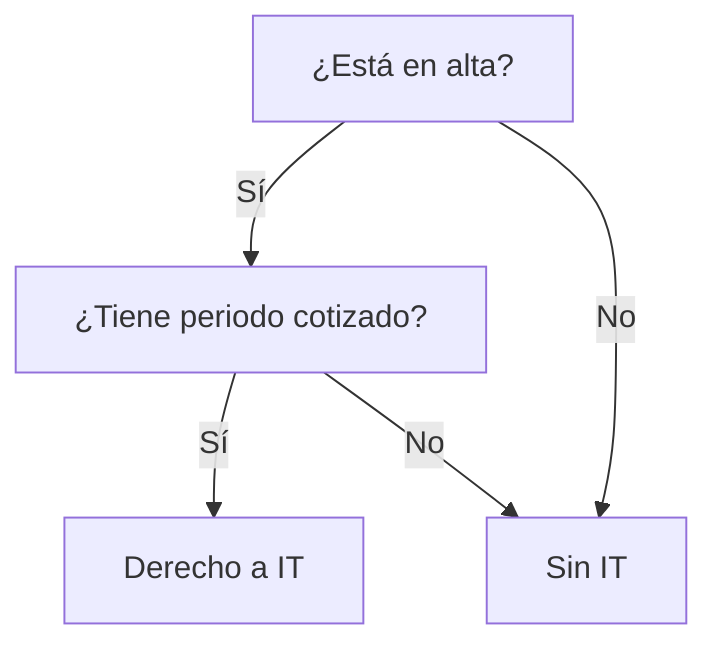

# PLAN MAESTRO — "SERIE TURCA" OPOS SS C1 2026

> **Fecha:** 21/04/2026
> **Cuerpo objetivo:** Cuerpo Administrativo Seguridad Social C1 (BOE-A-2025-27158, 31/12/2025)
> **Método:** NEXO — Ciclo Vital del Trabajador como columna vertebral
> **Objetivo:** Diferenciarnos de DM sin copiarle, con rigor legal + memorabilidad narrativa + calidad técnica.

---

## 0. TL;DR (resumen ejecutivo)

Vamos a construir una **wiki opositora en 3 capas interconectadas por wikilinks**:

1. **Capa TÉCNICA** — 13 fichas de tema + 23 generales, neutras, basadas en BOE literal.
2. **Capa NARRATIVA** — 6 personajes con vidas entrelazadas tipo "serie turca", cada capítulo resuelve trampas reales.
3. **Capa PRÁCTICA** — Trampas YAML ya curadas + calculadoras 2026 + simulacros.

Todo **sin copiar DM**: estructura del BOE (libre), ejemplos propios, esquemas propios, voz propia.

---

## 1. Marco legal — cómo diferenciarnos de DM sin violar copyright

### 1.1 Qué SÍ es libre (dominio público)

- **Temario oficial BOE** (estructura de los 13 específicos + 23 generales) — es ley.
- **Artículos de leyes** (TRLGSS, RGC, RAFBE, RD 1415/2004, RD 84/1996, etc.) — dominio público.
- **Datos numéricos** (SMI, topes, %, plazos, fechas) — los hechos no se protegen.
- **Jurisprudencia** (sentencias TS, TC, TSJ) — libre.

### 1.2 Qué tiene copyright de DM (y NO podemos copiar)

- Su **redacción literal** (párrafos, frases, resúmenes suyos).
- Sus **ejemplos concretos** inventados (los Pedros, Marías, empresas…).
- Sus **esquemas visuales** específicos (diagramas, tablas con su diseño).
- Sus **ejercicios y simulacros** originales.
- Su **tono, orden pedagógico y voz**.

### 1.3 Estrategia limpia

Usar DM como **referencia de calidad** (legítimamente adquirido) pero **reescribir TODO** con:

- Fuente primaria = BOE (citar artículo, no manual).
- Ejemplos propios con el pool de personajes de este plan.
- Esquemas propios (Mermaid, Excalidraw, mapas mentales).
- Orden del temario oficial, no el de DM.

Resultado: **blindados legalmente + diferenciados pedagógicamente**.

---

## 2. Evaluación de la idea "serie turca con ciclo vital"

### 2.1 Pros (muchos)

- **Memoria narrativa >> memoria de listas.** El cerebro recuerda historias 10× mejor.
- **Mezcla natural de los 13 temas** (un personaje genera afiliación → cotización → prestación → recaudación).
- **Diferenciación total frente a DM** (DM enseña tema a tema; nosotros por casos humanos).
- **Encaja 100% con Método NEXO** (ciclo vital como columna vertebral).
- **Las trampas se integran solas** en las tramas.
- **Escalable**: se pueden añadir personajes y casos sin romper la estructura.

### 2.2 Contras reales

- ⚠️ **Consulta rápida por tema se complica** si solo hay narrativa → hace falta índice transversal.
- ⚠️ **Riesgo de "narrativitis"**: que el opositor recuerde la historia pero no el artículo.
- ⚠️ **Curva de creación alta** (guiones largos, coherencia entre capítulos).
- ⚠️ En examen hay preguntas **abstractas** que exigen saber la regla pura, no el caso.

### 2.3 Veredicto

**Idea potentísima, pero úsala como CAPA 2, no como capa única.**
La narrativa **complementa** la técnica, no la sustituye. Las 3 capas se interconectan por wikilinks en Obsidian.

---

## 3. Arquitectura de 3 capas

```
CAPA 1 — TÉCNICA (obligatoria, neutra, seca)
├── 13 fichas de tema (estructura BOE literal)
├── Mapas mentales por tema
└── Artículos raíz + jurisprudencia

CAPA 2 — NARRATIVA (pedagógica, memorable)
├── 6 personajes con vidas entrelazadas
├── "Temporadas" de 13 capítulos (uno por tema)
└── Cada capítulo resuelve 3–5 trampas reales

CAPA 3 — PRÁCTICA (test, cálculo, simulacro)
├── Trampas YAML ya curadas (600+)
├── Calculadoras 2026
└── Simulacros oficiales
```

### 3.1 Ejemplo de interconexión

Al abrir `Art. 168 TRLGSS` en Obsidian, automáticamente ves:

- **Tema** que lo trata (Capa 1).
- **Personajes** a los que afecta (Capa 2).
- **Trampas** que lo explotan (Capa 3).
- **Cálculos** asociados (Capa 3).
- **Jurisprudencia** relacionada.

---

## 4. Reparto de personajes (6 protagonistas, ciclo vital completo)

| # | Personaje | Edad | Fase vital | Temas que vehicula |
|---|---|---|---|---|
| 1 | **Amparo Rodríguez** | 23 | Entrada mercado laboral (prácticas, becario, primer contrato) | 1 Campo aplicación · 3 Afiliación/altas · 11 SEPE/desempleo inicial |
| 2 | **Darío Méndez** | 35 | Asalariado con hijos, accidente laboral | 4 Cotización · 7 IT/AT · 8 Maternidad/paternidad · 2 Acción protectora |
| 3 | **Pilar Sáez** | 42 | Autónoma societaria con SL y empleados | 1 Regímenes especiales · 4 Cotización RETA/SETA · 8 Nacimiento |
| 4 | **Bartolomé Cañete** | 51 | Empresario con impagos y derivaciones | 5 Recaudación · 6 Gestión recaudatoria ejecutiva · 12 Responsabilidad empresa |
| 5 | **Carmen Ibáñez** | 58 | Despido, prejubilación, jubilación parcial | 9 Jubilación · 10 Jubilación anticipada/activa · 11 Desempleo maduro |
| 6 | **Estanislao Vela** | 72 | Pensionista, revalorización, complementos | 9 Pensiones · 13 Recursos del sistema · complementos mínimos |

### 4.1 Relaciones entrelazadas (la "serie turca")

- **Amparo** es **sobrina** de **Carmen** → hereda pensión de viudedad cuando muere el marido de Carmen.
- **Darío** trabaja en la empresa de **Bartolomé** → accidente genera responsabilidad solidaria.
- **Pilar** es **abogada-autónoma** que asesora a todos → vehículo pedagógico para procedimientos.
- **Estanislao** es el **padre** de **Bartolomé** → pensión + dependencia + complementos.
- **Carmen** es **hermana** de **Darío** → cuando él tiene el accidente, ella gestiona los papeles.

Con esto, **1 capítulo = 1 tema** oficialmente, pero **cruza 2–3 personajes** → los opositores viven los 13 temas como un universo, no como 13 silos.

### 4.2 Fichas maestras a crear (ruta)

```
wiki/personajes/
├── amparo.md
├── dario.md
├── pilar.md
├── bartolome.md
├── carmen.md
└── estanislao.md
```

Cada ficha incluye: frontmatter YAML (edad, régimen SS, familia, empresa), biografía breve, árbol familiar, listado de capítulos en los que aparece, trampas asociadas.

---

## 5. CAPA 1 — Fichas técnicas por tema

### 5.1 Estructura

```
wiki/temario/
├── bloque_general/
│   ├── tema_01_constitucion.md
│   ├── ... (23 temas)
│   └── tema_23_...md
└── bloque_especifico_ss/
    ├── tema_01_campo_aplicacion.md
    ├── tema_02_accion_protectora.md
    ├── ...
    └── tema_13_recursos_sistema.md
```

### 5.2 Plantilla de ficha técnica (cada tema)

```markdown
---
tema: N
bloque: especifico | general
titulo_oficial: "..." (texto literal BOE)
leyes_raiz: [TRLGSS, RD 1415/2004, ...]
personajes_asociados: [Darío, Pilar]
trampas_count: N
ultima_revision: 2026-04-21
---

# Tema N — Título oficial

## 1. Contenido oficial BOE (literal)
> [cita literal del temario oficial]

## 2. Mapa mental del tema
[Mermaid mindmap]

## 3. Leyes clave y artículos raíz
[tabla con wikilinks]

## 4. Conceptos esenciales
[glosario]

## 5. Jurisprudencia relevante
[sentencias clave]

## 6. Trampas asociadas
[wikilinks a YAML generado]

## 7. Capítulos narrativos
[wikilinks a capítulos de la Capa 2]

## 8. Cálculos y fórmulas
[wikilinks a calculadoras]
```

---

## 6. CAPA 2 — Narrativa (serie turca)

### 6.1 Estructura

```
wiki/capitulos/
├── temporada_1_entrada_al_sistema/
│   ├── cap_01_amparo_primer_contrato.md
│   ├── cap_02_dario_afiliacion_empresa.md
│   ├── ...
└── temporada_2_vida_activa/
    ├── cap_05_recaudacion_bartolome.md
    ├── ...
```

### 6.2 Plantilla de capítulo

```markdown
---
capitulo: N
tema_asociado: [3, 5]
personajes: [Amparo, Darío]
trampas_resueltas: [t_001, t_045, t_189]
leyes_aplicadas: [art. 15 TRLGSS, art. 30 RGC]
duracion_estudio: 25 min
---

# Capítulo N — [Título narrativo]

## Situación
[narrativa del caso]

## Conflicto legal
[qué problema plantea]

## Resolución paso a paso
[desarrollo]

## Trampas que caen aquí
[wikilinks]

## Regla nuclear
[resumen abstracto para examen]
```

### 6.3 Cada capítulo debe cumplir 3 funciones

1. **Narrar** un caso memorable con los personajes.
2. **Aplicar** reglas legales concretas (con cita de artículos).
3. **Exponer** trampas reales + antídotos.

---

## 7. CAPA 3 — Práctica

### 7.1 Trampas YAML → wiki ya existe

- Base: `academias/1_casos_recientes_2026_DM/trampas_unificadas_v2_CURADO.yaml` (~600 trampas).
- Regeneración: `scripts/maintenance/regenerar_vault_trampas.py`.
- Output actual: `/mnt/d/BOVEDA_OPOS/BOVEDA_OPOS/wiki/`.

### 7.2 Modo "minimal" del regenerador (NUEVO, a implementar)

Añadir a `regenerar_vault_trampas.py` un flag `--minimal`:

- Nueva función `build_note_minimal(trap)` con plantilla reducida.
- Campos mantenidos (allowlist, no blocklist → más seguro):
  - `trampa_tipica` (enunciado del error).
  - `regla_correcta` (norma aplicable).
  - `articulos_clave` (referencia legal).
  - `etiquetas` (opcional).
  - Wikilinks a temas/personajes.
- Campos descartados:
  - `_traza`, `confirmado_por_humano`, `meta_verificacion`.
  - `notas_verificacion_futuras`, timestamps, origen_academia.
  - Todo lo que empiece por `_`.
- Flag `--output-dir wiki_publico_minimal/` para no pisar el vault principal.

Doble salida:

- `wiki/` = completo (con metadatos, uso interno).
- `wiki_publico_minimal/` = solo regla + trampa + ley (publicable / Anki / compartible).

### 7.3 Calculadoras 2026

- Base: `backend/calculators/calculos_ss_extended.py` + `constantes_2026.py`.
- Embed en Obsidian (plugins o HTML exportado): BR, IT, jubilación, cotización.
- 1 calculadora = 1 sub-nota por tema.

### 7.4 Simulacros

- Carpeta dedicada `wiki/simulacros/`.
- Exámenes reales oficiales (BOE publica exámenes pasados, son libres).
- Plantilla de análisis por pregunta: trampa detectada → artículo clave → regla → respuesta correcta.

---

## 8. Ideas creativas adicionales (las 12 que vamos a implementar)

### A. Árbol de leyes con backlinks inversos
Ya hay base en Obsidian: abrir `Art. 109 TRLGSS` muestra trampas que lo tocan + temas + personajes + jurisprudencia.
**Cómo:** wikilinks en todos los campos `articulos_clave` del YAML. Obsidian genera el grafo automáticamente.

### B. Matriz 13×13 "puentes entre temas"
Tabla explícita de conexiones. Ej: Tema 3 ↔ Tema 5 → "sin alta no hay cotización, sin cotización hay deuda".
**Cómo:** una nota `wiki/transversal/matriz_puentes.md` con tabla Markdown + wikilinks.

### C. Error Museum
Ranking de las 100 trampas que **más caen**, clasificadas por nivel (obvia / sutil / trampa-trampa), cada una con su antídoto mnemotécnico.
**Cómo:** script que ordene trampas YAML por campo `frecuencia_en_examenes` + `nivel_sutileza` + export a `wiki/rankings/error_museum.md`.

### D. Timeline legal 1966→2026
Línea de tiempo con todas las leyes SS desde la LGSS original. Click en un nodo = ver qué trampas genera esa ley.
**Cómo:** plugin Timeline de Obsidian + nota por ley con `fecha_publicacion` en frontmatter.

### E. Calculadoras 2026 embebidas
Ver sección 7.3.

### F. Flowcharts de decisión (Mermaid)
"¿Tengo derecho a IT?" → flujo visual. Obsidian soporta Mermaid nativo.
**Cómo:** 1 flowchart por algoritmo clave. Carpeta `wiki/flowcharts/`. Plantilla:


### G. Diccionario de falsos amigos
"Subsidio ≠ pensión", "cese actividad ≠ paro", "hecho causante ≠ solicitud", "base reguladora ≠ base cotización".
**Cómo:** nota `wiki/glosario/falsos_amigos.md` + wikilinks desde cada trampa.

### H. Mapa mental maestro (1 imagen)
SVG/PNG gigante con los 13 temas + conexiones. Mirada de 1 min = foto mental de toda la oposición.
**Cómo:** generar con Excalidraw o Mermaid. Guardar en `wiki/maestro/mapa_maestro.md` (embed SVG).

### I. Glosario de siglas con hovers
SS, SEPE, TGSS, INSS, ISM, RETA, RGSS, RETS, SETA, MCSS, LGSS, TRLGSS… 100+ siglas.
**Cómo:** nota `wiki/glosario/siglas.md` + wikilinks con alias → hover en Obsidian = expansión.

### J. Wiki de "tropos" tipo TVTropes
Humor + rigor:
- "La prestación por no trabajar que exige haber trabajado" (desempleo contributivo).
- "El responsable que no es solidario hasta que hay derivación".
- "La jubilación activa que no es jubilación ni actividad del todo".
**Cómo:** carpeta `wiki/tropos/` con 1 nota por tropo, wikilinks a trampas reales.

### L. Biblioteca de formularios oficiales
TA.1, TA.2, TC.1, TC.2…. los oficiales, con errores frecuentes señalados.
**Cómo:** `wiki/formularios/` + PDFs oficiales + notas explicativas.

### M. Spaced Repetition (Anki / Mochi)
Export del YAML de trampas → CSV Anki → repaso científico.
**Cómo:** script `scripts/export/yaml_a_anki.py` que convierta trampas minimal en cards CSV.

> **Nota:** omitimos la idea K (audio-casos TTS) por decisión del usuario.

---

## 9. Plan de ejecución por fases

### FASE 0 — Cierre de sesión actual (21/04/2026) ✅
- Plan escrito (este documento).
- Memory MCP actualizado con la sesión.

### FASE 1 — Fundación (próxima sesión)
1. **Validar y cerrar** reparto definitivo de los 6 personajes (nombres, edades, relaciones).
2. **Crear fichas maestras** de los 6 personajes en `wiki/personajes/`.
3. **Crear estructura de carpetas** del vault (ramas de los 3 capas).

### FASE 2 — Modo minimal del YAML regenerator (~2h código)
1. Implementar flag `--minimal` en `regenerar_vault_trampas.py`.
2. Probar generación a `wiki_publico_minimal/`.
3. Validar que no filtra metadatos privados.

### FASE 3 — Piloto técnico + narrativo (1 tema completo)
1. Elegir tema piloto: **Tema 7 — Incapacidad Temporal** (es el que más trampas tiene y es fácil de narrativizar con Darío).
2. Crear ficha técnica (Capa 1).
3. Crear capítulo narrativo (Capa 2).
4. Vincular trampas existentes (Capa 3).
5. Revisar pedagógicamente.

### FASE 4 — Réplica a los 12 temas restantes
- 1 tema por sesión (ficha + capítulo + vinculaciones).
- ~13 sesiones de trabajo.

### FASE 5 — Ideas creativas adicionales (orden de prioridad)
1. **G Diccionario falsos amigos** (rápido, alto impacto).
2. **B Matriz 13×13** (visual, muy útil).
3. **F Flowcharts Mermaid** (1 por algoritmo clave).
4. **I Glosario siglas** (rápido).
5. **C Error Museum** (ranking trampas).
6. **D Timeline legal** (requiere plugin Obsidian).
7. **J Tropos** (creativo, memorable).
8. **H Mapa maestro** (trabajo gráfico, 1 hit).
9. **A Backlinks automáticos** (ya emerge con wikilinks bien puestos).
10. **E Calculadoras embebidas** (ya hay backend).
11. **M Spaced Repetition export Anki**.
12. **L Biblioteca formularios** (al final).

### FASE 6 — Bloque general (23 temas)
Hacer lo mismo que con el específico, pero en menos profundidad narrativa (menos personajes, más datos).

---

## 10. Decisiones pendientes (para mañana)

1. **¿Mantenemos los 6 personajes propuestos o ajustamos nombres/edades?**
2. **¿Empezamos por FASE 1 (personajes) o por FASE 2 (modo minimal)?** Recomendación: FASE 2 primero (2h de código + resultado inmediato usable), luego FASE 1.
3. **¿Incluimos a Pilar como abogada o la hacemos autónoma pura?** (Si abogada, es vehículo pedagógico; si autónoma, más realista. Se puede combinar.)
4. **¿Vamos a publicar el `wiki_publico_minimal/` en GitHub / GitLab / Obsidian Publish, o uso interno solo?** Condiciona el nivel de anonimización final.
5. **¿Qué hacemos con `MC MUTUAL` (marca real)?** Opciones: (a) sustituir por "mutua colaboradora", (b) dejarla si es contexto didáctico neutro, (c) reemplazar por mutua ficticia ("Mutua Horizonte" por ejemplo).

---

## 11. Archivos y recursos clave

### Código existente
- `backend/scripts/limpiar_nombres_yaml.py` — limpieza preproceso YAML.
- `scripts/maintenance/regenerar_vault_trampas.py` — generador de wiki.
- `backend/calculators/calculos_ss_extended.py` + `constantes_2026.py` — cálculos.
- `backend/scripts/ingest_neo4j_v17.py` — ingesta leyes a Neo4j.

### Datos existentes
- `academias/1_casos_recientes_2026_DM/trampas_unificadas_v2_CURADO.yaml` — 600+ trampas curadas.
- `academias/1_casos_recientes_2026_DM/temario_troceado_v2026/tema_*.md` — 13 temas específicos DM (referencia, NO copiar).
- `extracted_texts/examenes_oficiales_academias/TEMARIO_OFICIAL_BOE_2026_C1.md` — temario oficial literal (vacío, pendiente descarga).
- Vault destino: `/mnt/d/BOVEDA_OPOS/BOVEDA_OPOS/wiki/`.

### Documentos de plan anteriores
- `20_04_26_PLAN_WIKI_NEXO_v5_1.md` — plan maestro de la wiki.
- `18_04_26_ESTRATEGIA_EXTRACCION_SABIDURIA_v1.2.md` — pipeline de ingestión.
- `11_04_26_MEMORIA_LEYES_PORFIN.MD` — memoria leyes Neo4j.

---

## 12. Métricas de éxito

Al acabar el trabajo:

- [ ] 6 fichas de personaje completas con árboles familiares y biografías.
- [ ] 13 fichas técnicas (Capa 1) + 23 del bloque general.
- [ ] ~30 capítulos narrativos (media 2–3 por tema específico).
- [ ] 600+ trampas vinculadas (wikilinks a temas + personajes + leyes).
- [ ] Modo minimal funcionando, output a `wiki_publico_minimal/`.
- [ ] Matriz 13×13 + timeline legal + glosario siglas + diccionario falsos amigos.
- [ ] 20+ flowcharts Mermaid de algoritmos clave.
- [ ] Export Anki funcional.

---

## 13. Notas de sesión (21/04/2026)

- **Cierre**: se agotan los tokens. Siguiente sesión mañana.
- **Tareas inmediatas mañana**: revisar este plan con el usuario, decidir orden (FASE 1 vs FASE 2), arrancar.
- **Estado Memory MCP**: actualizado con esta sesión.
- **Estado YAML trampas**: curado (fase de depersonalización pendiente, decidido en este mismo plan: wiki_publico_minimal/ será la versión limpia).

---

**FIN DEL PLAN. Hasta mañana.**
