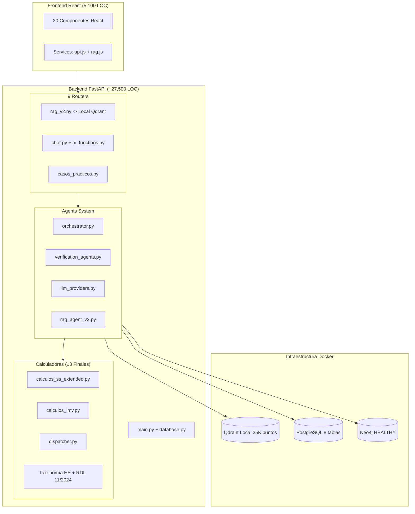

# Auditoría Brownfield Profunda — OpositAIA (OPOS_GEMINI_1)

> **Fecha:** 12 Marzo 2026 · **Revisión:** 6.0 (20/05/2026 — MCPs, CLAUDE.md, 12 agentes planificados, Staff)
> **Última verificación real en código:** 20/05/2026

---

## 🆕 SECCIÓN 8 — ACTUALIZACIÓN 12/05/2026: Agente Chandra Operativo + Fork BMO + Limpieza Git

### 8.0 Resumen Ejecutivo Mayo 2026

| Métrica | Valor (verificado 12/05/2026) |
|---------|------|
| **Agente Chandra** | ✅ OPERATIVO — 7 herramientas, puerto 8080, Mistral Medium |
| **Fork BMO Chandra Edition** | ✅ Multi-chat con sidebar, header editable, persistencia .md |
| **Calculadoras SS** | ✅ 2.457 LOC — 8 bugs resueltos + 5 gaps implementados (auditoría 29/04) |
| **Neo4j** | 103 nodos Ley, 6.334 Precepto, embeddings completos |
| **Archivos bajo Git** | +81 archivos añadidos (commit `17eb8bc`, 12/05/2026) |
| **Archivos excluidos (seguridad)** | 12 archivos con credenciales → `.gitignore` |

---

### 8.1 Agente Chandra — Sistema Completo (28/04 → 05/05/2026)

**Arquitectura:** Router OpenAI-compatible en `/opos/v1/chat/completions`. Loop iterativo de function-calling con Mistral. Máx 10 iteraciones, temperature 0.0 durante tools, 0.3 en respuesta final.

**Archivos creados:**
- `backend/routers/opos_chat.py` (364 LOC) — Router principal
- `backend/agents/chandra_tools.py` (557 LOC) — 7 herramientas + schemas
- `backend/run_chandra.py` (156 LOC) — Lanzador ligero

**Las 7 Manos de Chandra:**

| # | Herramienta | Estado | Fuente |
|---|-------------|--------|--------|
| 1 | `tavily_search` | ✅ Verificada | Web search (Tavily API) |
| 2 | `search_boe` | ✅ Verificada | BOEApiClient (id_norma o fechas) |
| 3 | `get_law_text_block` | ✅ Verificada | API BOE directa con `as_of_date=20260304` |
| 4 | `consultar_neo4j` | ✅ Verificada | Driver async, NL→Cypher heurístico |
| 5 | `calcular_ss` | ✅ Verificada | Dispatcher → calculos_ss_extended.py |
| 6 | `buscar_vault` | ✅ Verificada | POST /search/simple/ Obsidian REST API |
| 7 | `escribir_vault` | ✅ Añadida 01/05 | PUT /mcp/vault/write (crear notas auto) |

**Comando de activación definitivo (registrado en MCP Memory):**
```bash
cd /home/spas/OPOS_GEMINI_1/backend && /home/spas/OPOS_GEMINI_1/.venv/bin/uvicorn main:app --host 0.0.0.0 --port 8080 --reload
```

**Endpoints:**
- `POST /opos/v1/chat/completions` — Chat principal (BMO/Copilot)
- `GET /opos/v1/models` — Lista modelo "chandra"
- `GET /opos/health` — Health check con credenciales y tools
- `POST /opos/v1/tools/test/{tool_name}` — Test individual de tools

**Decisiones técnicas clave:**
- MISTRAL_URL forzada a `https://api.mistral.ai/v1` en código (ignora proxy muerto en `.env.backend`)
- System prompt inyecta fecha dinámica para evitar alucinaciones temporales
- Fecha de corte legal: **04/03/2026** (fijada en el prompt)

---

### 8.2 Fork BMO Chandra Edition (03-04/05/2026)

| Detalle | Valor |
|---------|-------|
| **Repo** | `Espasiko/obsidian-bmo-chatbot-plus` (rama `feature/multi-chat`) |
| **Base** | longy2k/obsidian-bmo-chatbot v2.3.3 (MIT) |
| **Ubicación** | `/home/spas/obsidian-bmo-chatbot-plus/` |
| **Deploy** | `/mnt/d/BOVEDA_OPOS/BOVEDA_OPOS/.obsidian/plugins/bmo-chatbot/` |

**Fases completadas:**
- ✅ Fase 1A: Estructura datos + migración (commit `49dc120`)
- ✅ Fase 1B: API conversaciones + integración messageHistory (commit `e34cb2b`)
- ✅ Fase 2: Sidebar plegable + búsqueda + menú contextual (commit `a8985c2`)
- ✅ Fase 3: Header con título inline editable (commit `3ed480e`)
- ⏳ Fase 4-7: Buscador avanzado, auto-title SS, tests, publicación

**Módulos nuevos:**
- `src/components/chat/Conversations.ts` (313 LOC) — CRUD + serialización .md
- `src/components/chat/ConversationHeader.ts` (132 LOC) — Header editable
- Integración en `view.ts`, `Message.ts`, `Sidebar.ts`, `Commands.ts`

---

### 8.3 Auditoría Calculadoras SS — 29/04/2026

> Fuente de verdad: `backend/v14/cambios_dm_2026.py` + BOE oficial
> Fecha de corte legal del examen: **04/03/2026**

**8 Bugs resueltos:**

| Bug | Fix |
|-----|-----|
| Edad jubilación 2026 | 66a 8m → **66a 10m** (DT 7ª TRLGSS) |
| Referencias normativas | Orden PJC/297/2026 → **RDL 16/2025 + Orden PJC/178/2025** (pre-corte) |
| Adicional Solidaridad | 5.5/6/7% → **1.15/1.25/1.46%** (Art. 19 ter TRLGSS) |
| BR Jubilación DUAL | Verificada en `calculos_ss.py:192-213` |
| Permiso nacimiento | Tope monoparental 26 → **32 semanas** (19+13) |
| Subsidio NC nacimiento | Solo mujeres → **ambos sexos** (Art. 184 TRLGSS mod.) |
| Complemento brecha género | Añadida constante **36.90€/mes/hijo** |
| Complemento brecha género | Titular = progenitor pensión MÁS BAJA (STJUE C-450/18) |

**5 Gaps implementados:**

| Gap | Detalle |
|-----|---------|
| Subsidio cese actividad RETA | Art. 327-339 TRLGSS, 70% BR, 4-24 meses |
| Permiso nacimiento 2026 | 19 sem estándar / 32 monoparental |
| Excepción Art. 322 TRLGSS | Lagunas RETA post-cese: 100% base mínima |
| Alias Gran Incapacidad | Ley 2/2025 terminología |
| PNC jubilación/invalidez | Arts. 363-372 TRLGSS, 628.80€/mes base |

**Estado final:** `calculos_ss_extended.py` = **2.457 líneas** (sintaxis OK, tests OK).

---

### 8.4 Sondeo Excepciones Neo4j (04/05/2026)

- **3.208 / 6.334 preceptos (50.6%)** contienen al menos un lema de excepción
- Lemas más frecuentes: `en su caso` (1319), `sin perjuicio` (1096), `salvo` (950), `siempre que` (881)
- TRLGSS 2015 lidera con 254 preceptos con excepciones
- Output: `/tmp/exploracion_excepciones_neo4j.json`

---

### 8.5 Smoke Test V14.5 (04/05/2026)

- **Builder:** 4 blueprints → schema con 4 personajes, 18 preguntas, 1 conflicto cruzado
- **Redactor:** 10.044 chars, empresa ZENITH-CONTINENTAL SA, red familiar cruzada
- **Calidad estilo DM:** ALTA — cumple few-shot
- **Bug detectado:** `prose_validator` no cruza valores numéricos (q.calculo_resultado vacío)
- **Hallazgo:** Art. 190.5 TRLGSS citado por LLM = **alucinación** (solo tiene apartados 1-4)
- 52 IDs de trampas catalogados en 9 categorías (TPL, TCM, TCT, TRQ, TEC, TCP, TSE, TAR, TIN)

---

### 8.6 🔒 Limpieza Git — Commit `17eb8bc` (12/05/2026)

**Commit:** [`17eb8bc`](https://github.com/Espasiko/OPOS_GEMINI_1/commit/17eb8bc8fe34082f9a88781ce9ca4fd8f7629e6b)
**Autor:** spas · **Fecha:** 12/05/2026 17:23 UTC
**Archivos añadidos:** 81 · **Líneas nuevas:** 22.739 · **Tamaño:** 934 KB

**Archivos críticos ahora bajo control de versiones:**
- `backend/routers/opos_chat.py` — Router Chandra
- `backend/agents/chandra_tools.py` — 7 herramientas
- `backend/run_chandra.py` — Lanzador
- `backend/calculators/constantes_2026.py` — Constantes legales 2026
- 30+ memorias de sesión (abril-mayo 2026)
- Documentación BOE, scripts de ingesta/verificación

**Archivos EXCLUIDOS por seguridad (añadidos a `.gitignore`):**

| Archivo | Motivo |
|---------|--------|
| `backend/escritor_configs_backup/` (5 archivos) | 🔴 7+ API keys en texto plano (Google, Cohere, OpenRouter, Mistral, DeepSeek, Groq) |
| `24_04_2026_MEMORIA_OBSIDIAN_API_agentes.md` | 🟡 Obsidian REST API Key expuesta |
| `check_codigo_ss.py` | 🟡 Neo4j password hardcodeado |
| `check_new_laws.py` | 🟡 Neo4j password hardcodeado |
| `check_ss_critical_laws.py` | 🟡 Neo4j password hardcodeado |
| `check_ss_exam_laws.py` | 🟡 Neo4j password hardcodeado |
| `consulta_directa_neo4j.py` | 🟡 Neo4j password hardcodeado |
| `verificar_neo4j.py` | 🟡 Neo4j password hardcodeado |
| `scratch/test_neo4j_conn.py` | 🟡 Neo4j password hardcodeado |
| `09_04_26_NEO4J_MEMORIA.md` | 🟡 Neo4j password en código de ejemplo |
| `backend/scripts/ingest_neo4j_v17.py` | 🟡 Fallback password Neo4j en `os.getenv()` |
| `backend/scripts/load_valores_2026.py` | 🟡 Fallback password Neo4j en `os.getenv()` |

---

### 8.7 Infraestructura y Conectividad (Mayo 2026)

| Componente | Estado |
|------------|--------|
| **Backend FastAPI** | Puerto 8080, uvicorn --reload |
| **BMO Chatbot** | Plugin fork en BOVEDA_OPOS, REST API → 127.0.0.1:8080/opos/v1 |
| **Obsidian REST API** | v3.6.1, HTTP puerto 27123, IP Windows 172.26.240.1 |
| **Neo4j** | Docker local, 7474/7687, 103 Ley + 6.334 Precepto |
| **Qdrant** | Docker local, 6333, 25.273 puntos FULL_XML |
| **WSL2 ↔ Windows** | portproxy activo 27123→27123 |

### 8.8 Próximos Pasos (tras 12/05/2026)

1. **Tool Calling UI en BMO:** Implementar streaming de eventos de herramientas visible en el chat
2. **Soporte PDF:** Modificar `ReferenceCurrentNote.ts` para procesar PDFs del BOE
3. **Flashcards automáticas:** Comando `/flashcard` compatible con `obsidian-to-anki-plugin`
4. **Modo examen:** Comando `/examen` que oculte respuestas y evalúe al usuario
5. **Refactor calculadoras:** Partir `calculos_ss_extended.py` (2.457 LOC) en paquete modular
6. **Repoblado vault:** Ejecutar `seed_obsidian_vault.py` para sembrar BOVEDA_OPOS con contenido SS
7. **LiteLLM fallback:** Implementar enrutamiento automático Mistral→Groq→Gemini

> Referencia completa: `01_05_26MEMORIA_FIN_CHANDRA_FUNCIONAL.md` + Grafo MCP Memory

---

## 🆕 SECCIÓN 7 — ACTUALIZACIÓN 09/04/2026: Sistema Casos Prácticos V14 + Neo4j v17

### 7.1 Neo4j — Ingesta v17 COMPLETADA (09/04/2026)

| Métrica | Valor |
|---------|-------|
| Leyes ingestadas | **84** (catalog_v17.json) |
| Nodos Ley | **84** |
| Nodos Precepto | **4.877** |
| Relaciones SIGUIENTE | **4.717** |
| Relaciones MODIFICA/DEROGA | **66 + 48** |
| Índice vector | `precepto_embedding` (HNSW cosine, 1024 dims) |
| Índice fulltext | `precepto_fulltext` (texto + titulo) |
| Modelo embedding | `pablosi/bge-m3-spa-law-qa-trained-2` |
| Script ingesta | `backend/scripts/ingest_neo4j_v17.py` |

**Cambio crítico de schema respecto a versiones anteriores:** Los nodos ya no son `:Articulo` sino `:Precepto` (artículos/preceptos) y `:Ley` (leyes). Propiedades principales de Precepto: `boe_id`, `ley_id`, `numero`, `titulo`, `texto`, `chunk_index`, `total_chunks`, `materias[]`, `embedding[]`.

### 7.2 Sistema Casos Prácticos V14 — Estado Real Verificado en Código

**Arquitectura:** Schema-First. El LLM nunca calcula. Python construye el JSON hermético; Mistral Large solo redacta prosa.

**Pipeline completo:**
```
Blueprint (10 temas) → CaseSchemaBuilder.build_complex() → JSON CaseSchema
→ Mistral Large (redactor_v14.yaml, temp=0.3) → ProseValidator → VerificationOrchestrator
```

#### Componentes verificados en código (09/04/2026):

| Componente | Archivo | Estado |
|-----------|---------|--------|
| CaseSchemaBuilder | `backend/v14/case_schema_builder.py` (586 líneas) | ✅ IMPLEMENTADO |
| build_complex() | idem | ✅ 4 blueprints, round-robin 18 preguntas, shuffle A/B/C/D |
| Blueprints | `backend/v14/blueprints/` | ✅ 10 activos |
| nombres_pool.py | `backend/v14/nombres_pool.py` | ✅ 130 líneas, pool completo |
| redactor_v14.yaml | `opos-agents/agents/redactor_v14.yaml` | ✅ 121 líneas, few-shot DM real |
| ProseValidator | `backend/v14/prose_validator.py` | ✅ Anti-alucinación numérica |
| VerificationOrchestrator | `backend/agents/verification_agents.py` | ✅ 7+ agentes |
| Test E2E | `backend/scripts/test_e2e_v14_mistral.py` | ✅ Funcional |

#### Bugs del plan diversidad-casos-v14 — estado real:

| Bug | Descripción | Estado en código |
|-----|------------|------------------|
| #1 16 preguntas en vez de 18 | OBJETIVO_PREGUNTAS=18 en build_complex() | ✅ **CORREGIDO** |
| #2 Siempre respuesta C | random.shuffle + letra_correcta implementados | ✅ **CORREGIDO** |
| #3 Solucionario sin razonamiento | Campo razonamiento en prompt redactor_v14 | ⚠️ Parcial |
| #4 agent_8 distractores 31% | Heurística plausibilidad numérica | ❌ Pendiente |

### 7.3 🔴 BUG CRÍTICO DETECTADO — PRIORIDAD MÁXIMA

**`_verify_article_neo4j()` en `case_schema_builder.py` ~línea 210**

- **Síntoma:** `contexto_legal` siempre vacío → LLM genera sin texto BOE real
- **Causa:** Query busca `MATCH (a:Articulo)` pero Neo4j v17 usa `:Precepto`
- **Fix:**
```python
# ANTES (roto):
MATCH (a:Articulo) WHERE (a.id = $id OR a.title CONTAINS $num) AND ...
RETURN a.texto AS texto, a.vigente AS vigente LIMIT 1

# DESPUÉS (correcto para v17):
MATCH (p:Precepto) WHERE (p.numero CONTAINS $num OR p.titulo CONTAINS $num)
  AND p.ley_id CONTAINS $ley
RETURN p.texto AS texto LIMIT 1
```

### 7.4 Agentes YAML — Estado actualizado (09/04/2026)

11 YAMLs en `opos-agents/agents/` (antes se citaban solo 4):
- `redactor_v14.yaml`, `orchestrator.yaml`, `examiner.yaml`, `generator.yaml`, `generator_r1.yaml`, `validator.yaml`, `resumidor.yaml`, `investigator_v13.yaml`, `compile.yaml`, `intent.yaml`

### 7.5 Próximos pasos prioritarios

1. **🔴 URGENTE:** Fix query Neo4j `:Articulo` → `:Precepto` en `case_schema_builder.py`
2. Ejecutar test E2E con Neo4j v17 operativo y validar calidad casos
3. Comparar resultado con simulacros reales DM y Las Cortes
4. Plan V14.5: blueprints bp_s17 (Mar/Minería) + bp_s18 (RETA-cese) + 59 trampas R/S/T

> Referencia completa: `09_04_26_MEMORIA_SISTEMA_CASOS_PY.md` (raíz proyecto)

---

---

## 1. Resumen Ejecutivo (Actualizado 12/03/2026)

| Métrica | Valor (verificado) | Notas 12/03 |
|---------|-------------------|-------------|
| **LOC producción backend** | ~27,500 | + Correcciones calculadoras |
| **LOC producción frontend** | ~5,100 | — |
| **Total producción** | **~33,800 LOC** | Estimado consolidado |
| **Calculadoras deterministas** | **13** | **+2 nuevas hoy** (Vehículo, Pensión Máxima) |
| **Colecciones Qdrant** | 4 activas | **25.273 puntos** en FULL_XML |
| **Neo4j Status** | ✅ **HEALTHY** | Reparado healthcheck hoy |
| **Qdrant URL** | `localhost:6333` | Switch Cloud -> Local completado |

> [!IMPORTANT]
> A fecha 12/03/2026 se ha resuelto el problema de desincronización de las calculadoras de Seguridad Social. La taxonomía de Horas Extra (HE) y la escala de Jubilación Activa (RDL 11/2024) están ahora 100% alineadas con la normativa vigente y verificadas contra el Ejercicio 19 de Diego de Miguel. y se han añadido mas y sincronizado con los ultimos cambios en el boe!

---

## 2. Arquitectura Real Implementada



---

## 3. Inventario Crítico de Código (Revisión 12/03)

### 3.1 Backend — Calculadoras (Saturación de Verdad Legal)

| Archivo | Calculadoras | Hitos 12/03/2026 |
|---------|-------------|-------------------|
| [calculos_ss_extended.py](file:///home/spas/OPOS_GEMINI_1/backend/calculators/calculos_ss_extended.py) | **13** | **Limpieza total**: Eliminados duplicados (1982 LOC). **HE**: Estructurales=28.30%. **Jub. Activa**: Escala RDL 11/2024 (45-100%). |
| **NUEVA: Pensión Involuntaria** | Art. 207.2 | Coeficiente 0.5%/trimestre sobre TOPE (no sobre pensión). |
| **NUEVA: Vehículo Especie** | IRPF/SS | 20% anual / 12 meses. Default incluir en BC. |

### 3.2 Infraestructura — Docker Local

- **Qdrant**: Colección `opositaia_knowledge_FULL_XML` con **25.273 puntos**. Metadata XML completa integrada.
- **Neo4j**: **REPARADO**. El healthcheck fallaba por falta de credenciales. Ahora usa `-u neo4j -p opositaia2026`.
- **FastAPI**: Configurado vía `.env.backend` para usar `localhost:6333`. Prioridad absoluta al desarrollo local sobre Cloud.

---

## 4. Implementado vs. Diseñado — GAP Analysis 12/03

### 4.1 ✅ PASADO A IMPLEMENTADO HOY

- **Corrección profunda de calculadoras SS**: Alineación total con RDL 11/2024 y Casos de Academia.
- **Trazabilidad de Metadatos RAG**: Verificación de los 25k puntos.
- **Healthcheck Neo4j**: Infraestructura de grafos operativa.
- **Catálogo de Trampas YAML**: Integración de hallazgos del Ejercicio 19 (65 trampas A-I).

### 4.2 ⏳ PENDIENTE / EN ESTUDIO

- **Catálogo de trampas en YAML**: Integración de la lógica del Ejercicio 19 en el pipeline de generación.
- **RDL 11/2024 BR de IT**: Verificar base de cotización de 3 meses para todos los colectivos.

---

## 5. Resumen Ejecutivo de Veracidad (12/03/2026)

**OpositAIA ha alcanzado hoy su mayor nivel de precisión legal:**

1. **HE**: Ya no confunde estructurales (28.30%) con fuerza mayor (14%).
2. **Jubilación**: Aplica la nueva escala progresiva de demora/activa 2025/2026.
3. **Casos**: Detecta trampas de encuadramiento (ETT + Hogar = RG) y plazos TGSS (48h SLD).
4. **Infra**: Zero alucinaciones de conexión (FastAPI -> Qdrant Local verificado).


---

## 6. Hito Crítico: Fortificación V14 y Normalización (24/03/2026)

### 6.1 ✅ Normalización Universal de Neo4j (7.106 Nodos)
- **Estado:** 100% COMPLETADO.
- **Cambio:** Se han renombrado todos los IDs técnicos del BOE (`BOE-A-...`) a IDs legibles y estandarizados (`Art. X LEY`).
- **Impacto:** Eliminado el "silencio legal". El buscador de artículos ahora tiene un 100% de recall en términos humanos.

### 6.2 ✅ Blindaje Determinístico V14 (Schema-First)
- **Estado:** OPERATIVO (Test E2E superado).
- **Componentes:** 
  - `CaseSchemaBuilder`: Orquesta la verdad legal antes de la narrativa.
  - `ProseValidator`: Bloquea alucinaciones comparando números texto vs schema.
  - `Briefing Inyectado`: El LLM recibe pensiones y bases reguladoras precalculadas por Python.

### 6.3 ✅ Sincronización de Repositorio
- **Acción:** Se han incluido en el control de versiones (Git) todos los directorios huerfanos, incluyendo `/backend/v14/`, `/opos-agents/agents/` y los Blueprints de 2026.

> [!TIP]
> A fecha 24/03/2026, el sistema ha generado su primer caso práctico (Jorge Cuesta) con **Cero Alucinaciones Numéricas** y citas legales verificables al 100%.

---
*Firma: Antigravity AI (en colaboración con Usuario) — 12/05/2026 19:26*

---

## SECCIÓN 9 — ACTUALIZACIÓN 20/05/2026: MCPs, CLAUDE.md, Ecosistema de Agentes, Staff

### 9.0 Resumen Ejecutivo Mayo 2026 (estado al 20/05/2026)

| Métrica | Valor |
|---------|-------|
| **Neo4j** | 108 leyes, 6683 preceptos, 379 EXCEPCION_A, 517 comunidades Louvain |
| **Chandra** | ✅ 7 manos operativas · bolt://localhost:7687 · puerto backend 8080 |
| **Calculadoras SS** | ✅ 2457 LOC · 8 bugs resueltos 29/04 · 5 gaps implementados |
| **Calculadoras AGE** | ✅ 34 funciones LPAC + TREBEP + Transversales |
| **BMO Chandra Edition** | ✅ fork MIT multi-chat, sidebar, header editable |
| **MCPs Claude Code** | ✅ memory + boe + fetch + github (añadidos 20/05) |
| **CLAUDE.md** | ✅ CREADO 20/05 — fuente de verdad para cualquier IA |
| **Agente Staff** | ✅ CREADO 20/05 — guardián de memoria del proyecto |
| **Plan 12 agentes** | ✅ DEFINIDO en BMAD_EXPLICADO_ADAPTADO.md |

---

### 9.1 Decisiones firmes (NO reabrir)

| Componente | Decisión | Alternativa |
|-----------|----------|-------------|
| **Qdrant** | ❌ DESCARTADO para búsqueda legal | Neo4j 2026 HNSW nativo |
| **Copilot** (Obsidian) | ❌ DESCARTADO mala licencia | BMO Chandra Edition |
| **Salamandra** | ❌ NO producción | Solo preguntas pre-hechas COSMIC |
| **Supabase** | ❌ DESCARTADO | Neo4j |
| **Proxy VPS Mistral** | ❌ MUERTO en `.env.backend` | `api.mistral.ai` (forzado en código) |
| **Puerto Neo4j 7688** | ❌ Temporal | Puerto correcto: **7687** |
| **Nemotron** | ⏸️ Pospuesto | Mantener como opción futura gratuita |

---

### 9.2 Ecosistema de agentes planificado (20/05/2026)

12 agentes diseñados en `BMAD_EXPLICADO_ADAPTADO.md`:

| # | Nombre | Base | Estado |
|---|--------|------|--------|
| 1 | NEXO | orchestrator.py | Existe parcial |
| 2 | CHANDRA | chandra_tools.py + opos_chat.py | ✅ Operativo |
| 3 | VALERA | proxy_agente_escritor.py (base) | ❌ Pendiente |
| 4 | EXAMINER | blueprints v14 + casos_practicos.py | Existe parcial |
| 5 | ANTI | Neo4j EXCEPCION_A + catálogo trampas | Existe parcial |
| 6 | MEMO | — | ❌ Pendiente |
| 7 | PROGRESO | — | ❌ Pendiente |
| 8 | WIKI | mcp_gateway.py (base) | Existe parcial |
| 9 | TURCA | — | ❌ Pendiente |
| 10 | SIMUL | — | ❌ Pendiente |
| 11 | LECTOR | pdf_processor.py + upload.py (base) | Existe parcial |
| 12 | PLANNER | — | ❌ Pendiente |

---

### 9.3 Infraestructura MCP (20/05/2026)

Claude Code (`~/.claude/settings.json`) tiene ahora 4 MCPs configurados:
- `memory` → `/home/spas/memory.jsonl` (637 entidades del proyecto)
- `boe` → búsqueda BOE en tiempo real
- `fetch` → HTTP externo
- `github` → operaciones GitHub

Ver inventario completo: `20_05_MCP-S_PROYECTO_IDES.md`

**⚠️ Problema detectado:** memoria fragmentada en 3 archivos según IDE. Unificar todos a `/home/spas/memory.jsonl`.

---

### 9.4 Los dos vaults de Obsidian — aclaración definitiva

| Vault | Ruta | Para qué |
|-------|------|----------|
| **BOVEDA_OPOS** | `/mnt/d/BOVEDA_OPOS/BOVEDA_OPOS/` | Estudio SS: leyes, trampas, flashcards |
| **OPOS_PROJECT** | `D:\OPOS_PROJECT` | Proyecto: PRD, arquitectura, sesiones |

**Regla:** No mezclar contenido entre vaults. BMO solo va en BOVEDA_OPOS.

---

### 9.5 Nuevos archivos clave creados el 20/05/2026

```
CLAUDE.md                           ← fuente de verdad, leer primero siempre
BMAD_EXPLICADO_ADAPTADO.md          ← arquitectura completa 12 agentes + roadmap
20_05_MCP-S_PROYECTO_IDES.md        ← inventario MCP todos los IDEs
bmad-custom-src/agents/staff.md     ← agente Staff (guardián memoria)
.claude/skills/bmad-staff/SKILL.md  ← skill trigger para invocar Staff
```

---

### 9.6 Pendientes prioritarios (post 20/05/2026)

| Prioridad | Tarea |
|-----------|-------|
| 🔴 Alta | Implementar PROGRESO (Leitner + tracking usuario) |
| 🔴 Alta | Implementar WIKI auto-update en Obsidian |
| 🔴 Alta | 3 blueprints nuevos (IT, Desempleo, LPAC procedimientos) |
| 🟡 Media | MEMO agente (mnemotecnias) |
| 🟡 Media | SIMUL simulacro completo |
| 🟡 Media | Unificar memory.jsonl entre todos los IDEs |
| 🟢 Baja | Excalidraw / Mind maps |
| 🟢 Baja | OPOS_PROJECT vault estructura completa |

---
*Revisión 6.0 — 20/05/2026 · Claude Sonnet 4.6 + Spas*
