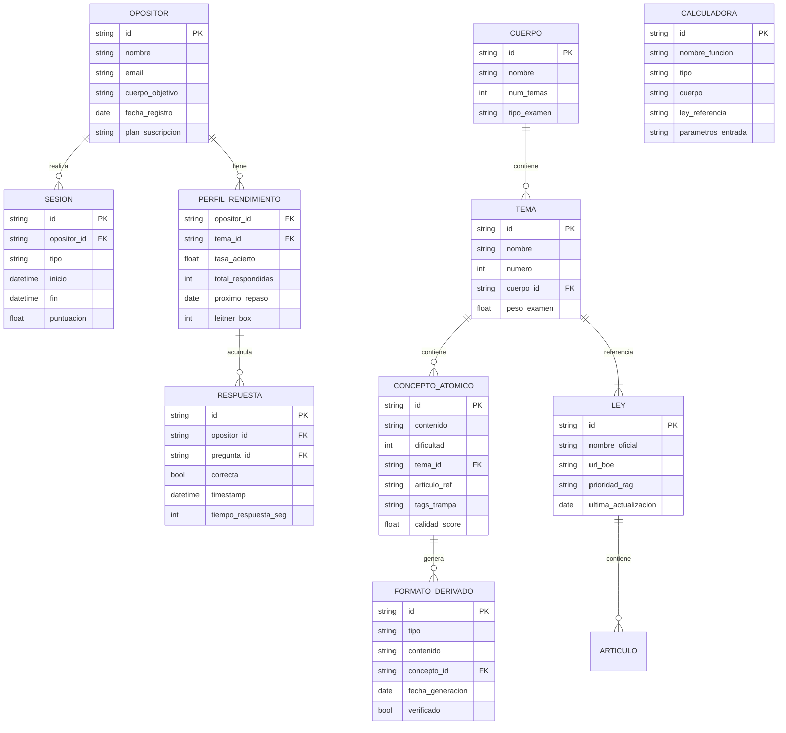

# Product Requirements Document — OpositAIA V2

**Autor:** Spas  
**Fecha:** 03/03/2026  
**Versión:** 1.1  
**Estado:** ✅ Sincronizado 100% con implementación  
**Product Brief:** [product-brief.md](file:///home/spas/OPOS_GEMINI_1/docs/product-brief.md)

---

## 1. Resumen Ejecutivo

**OpositAIA** es una plataforma de preparación para oposiciones AGE y SS que combina inteligencia artificial, un motor de cálculos legales determinístico (Python) y contenido verificado contra el BOE para ofrecer estudio adaptativo personalizado.

### Problema

Los opositores enfrentan:
- **Material desactualizado** — Las leyes cambian frecuentemente y los manuales no se actualizan al mismo ritmo
- **Casos prácticos sin feedback** — No hay herramienta que resuelva cálculos de SS/AGE paso a paso con artículos citados
- **Estudio no personalizado** — Sin sistema que se adapte a las debilidades individuales del opositor
- **Coste elevado** — Las academias cobran €200-400/mes por contenido genérico

### Solución

Una plataforma donde:
1. Un **LLM jamás calcula** — Extrae parámetros del enunciado, ejecuta la función Python, narra el resultado con el artículo citado
2. Todo el contenido se verifica contra **RAG legal** (Qdrant + BOE XML)
3. El estudio se adapta al opositor con **repetición espaciada** y perfil de rendimiento
4. Modelo de contenido **COSMIC** — 1 concepto → 6+ formatos automáticamente

### Decisiones del Product Owner

| # | Decisión | Respuesta |
|---|---|---|
| 1 | Roadmap | ✅ 3 fases confirmadas |
| 2 | Neo4j | ✅ Local Docker primero |
| 3 | Scope inicial | ✅ **C1 Administrativo SS** primero, expandir después |
| 4 | Precios | ✅ **Trial €1/3 días + Pro €69/mes** |
| 5 | Foro | ✅ Post-E2E y despliegue |
| 6 | Mercado | ✅ **B2C primero** (B2B con academias más adelante) |

---

## 2. Criterios de Éxito

| Métrica | Fase 1 | Fase 3 |
|---|---|---|
| Precisión calculadoras | 100% | 100% |
| Cobertura normativa RAG | 100% leyes CRÍTICAS | 100% temario |
| Preguntas verificadas en banco | 5.000 | 54.000 |
| Usuarios registrados | 10 beta testers | 1.000 |
| Retención semanal | 70% | 90% |
| NPS | >50 | >70 |
| MRR | €100 | €5.000 |

---

## 3. User Journeys

### Journey 1: Opositor practica caso práctico SS

```
María (C1 SS) abre la app → Selecciona "Caso Práctico" → Elige tema "Jubilación"
→ App genera caso con datos parametrizados (edad, cotización, bases)
→ María intenta resolverlo → Envía su respuesta
→ Calculator Agent ejecuta calcular_jubilacion() con los parámetros
→ Verify Agent contrasta con artículos TRLGSS
→ App muestra: resultado exacto + pasos + artículos citados + dónde erró María
→ Pregunta se marca en el perfil → Repetición espaciada la reprogramará
```

### Journey 2: Opositor estudia con flashcards adaptativas

```
María abre "Repaso" → Sistema selecciona 20 flashcards priorizando:
  - Conceptos fallados recientemente (Leitner box 1)
  - Temas con peso alto en examen pero rendimiento bajo
→ Por cada flashcard: concepto → respuesta → autoevaluación (fácil/difícil/no sé)
→ Algoritmo SM-2 recalcula intervalos
→ Al terminar: resumen de progreso + siguientes recomendaciones
```

### Journey 3: Opositor realiza simulacro cronometrado

```
María selecciona "Simulacro C1 SS" → 70 preguntas tipo test + 60 minutos
→ Preguntas extraídas del banco verificado (dificultad adaptada al perfil)
→ Temporizador visible + progreso
→ Al terminar: nota + percentil + análisis por tema + errores con explicación
→ Temas débiles se refuerzan automáticamente en siguientes sesiones
```

### Journey 4: Opositor hace pregunta libre al chat

```
María escribe: "¿Cuánto cobra de jubilación alguien con 38 años cotizados y base reguladora de 2.100€?"
→ Intent Agent clasifica: cálculo_ss / jubilación
→ Calculator Agent ejecuta calcular_jubilacion(años=38, base=2100)
→ Chat responde: "Según art. 210 TRLGSS, con 38 años cotizados el % es 100%.
   Pensión mensual = 2.100,00 € (14 pagas). Nota: verificar tope máximo 2026."
→ Si María pregunta "¿y si tuviera 35 años?" → recalcula automáticamente
```

---

## 4. Modelo de Dominio



### Tipos enumerados clave

| Tipo | Valores |
|---|---|
| `cuerpo` | `C2_AUX_AGE`, `C1_ADM_AGE`, `C1_ADM_SS`, `A2_GESTION_SS` |
| `tipo_formato` | `test`, `flashcard`, `mapa_mental`, `caso_practico`, `esquema`, `mnemotecnia` |
| `tipo_calculadora` | `ss_contributiva`, `ss_no_contributiva`, `age_lpac`, `age_trebep`, `age_transversal` |
| `tipo_sesion` | `simulacro`, `repaso_espaciado`, `caso_practico`, `chat_libre`, `flashcards` |
| `plan` | `trial`, `pro` |

---

## 5. Innovación y Diferenciación

### 5.1 Motor Determinístico (Zero Hallucination Engine)

A diferencia de cualquier otra plataforma que usa LLMs para responder preguntas legales, OpositAIA garantiza **cero alucinaciones numéricas**:

- **55 calculadoras Python** con `Decimal` para precisión exacta
- El LLM **NUNCA** genera números: extrae parámetros → ejecuta función → narra resultado
- Cada resultado incluye el **artículo de ley citado** (verificable contra BOE)
- Si no existe calculadora para un cálculo específico → la app dice "no puedo calcular esto automáticamente" en vez de inventar

### 5.2 COSMIC: Create Once, Serve Many

Modelo de contenido donde **1 concepto atómico genera 6+ formatos** automáticamente:
- Test tipo examen → Flashcard → Mapa mental → Caso práctico → Esquema → Mnemotecnia
- Reduce coste de generación a ~€0 por formato derivado
- Calidad garantizada por pipeline de verificación (Verify Agent)

### 5.3 Repetición Espaciada Inteligente

Combinación de algoritmos Leitner y SM-2 adaptados al contexto de oposiciones:
- **5 cajas Leitner** con intervalos progresivos (1d → 3d → 7d → 14d → 30d)
- Priorización por **peso en examen** × **debilidad del opositor**
- Integración con perfil adaptativo para recomendar sesiones óptimas

---

## 6. Tipo de Proyecto

**Brownfield** — Existe un MVP funcional con:
- Backend FastAPI (9 routers, Docker Compose)
- 28 calculadoras SS operativas
- Qdrant RAG con 48.866 chunks
- Frontend React 19 con chat, progreso, generador de casos
- MCP Server con 9 tools
- 25 agentes diseñados (parcialmente operativos)

La evolución V2 **reutiliza** toda esta infraestructura y ha completado las capas críticas (64 calculadoras, COSMIC, sistema de agentes).

---

## 7. Scoping — Fase 1: Consolidación (C1 SS)

> [!IMPORTANT]
> Scope inicial limitado a **C1 Administrativo SS**. Los demás cuerpos se añaden en Fase 3.

### In Scope (Fase 1)

| Funcionalidad | Prioridad | Estado brownfield |
|---|---|---|
| 33 calculadoras AGE (`calculadora_age.py`) | 🔴 CRÍTICA | ✅ IMPLEMENTADO (100%) |
| RAG expandido (TRLGSS + Código 442) | 🔴 CRÍTICA | ✅ COMPLETADO |
| Simulacros cronometrados C1 SS | 🔴 CRÍTICA | ✅ IMPLEMENTADO |
| Autenticación Clerk | 🟠 ALTA | ❌ Por implementar |
| Migración localStorage → PostgreSQL | 🟠 ALTA | ⚠️ Schema existe, poco uso real |
| Tests automatizados calculadoras | 🟠 ALTA | ❌ Por implementar |

### In Scope (Fase 2)

| Funcionalidad | Prioridad |
|---|---|
| Neo4j local Docker (grafo COSMIC) | 🟠 ALTA |
| Pipeline COSMIC (1→6 formatos) | 🟠 ALTA |
| Repetición espaciada (Leitner/SM-2) | 🟠 ALTA |
| Banco 10K preguntas verificadas | 🟠 ALTA |
| Perfil adaptativo opositor | 🟠 ALTA |
| Sistema agentes orquestados | 🟠 ALTA |

### In Scope (Fase 3)

| Funcionalidad | Prioridad |
|---|---|
| Stripe (Trial €1/3d + Pro €69/mes) | 🔴 CRÍTICA |
| PWA / modo offline | 🟡 MEDIA |
| Mini-foro (post-E2E) | 🟡 MEDIA |
| Psicotécnicos | 🟡 MEDIA |
| Analytics predictivo | 🟢 BAJA |
| Expansión a C2, C1 AGE, A2 SS | 🟡 MEDIA |

### Out of Scope (V2)

- Dashboard de academia / reportes por alumno
- API pública para academias (B2B)
- Kits de contenido descargable
- Fine-tuning de modelos propios
- App nativa iOS/Android
- Gamificación competitiva (rankings entre usuarios)
- Memes educativos con IA

---

## 8. Requisitos Funcionales

### RF-01: Motor de Calculadoras

| ID | Requisito | Criterio de Aceptación |
|---|---|---|
| RF-01.1 | 27 calculadoras SS operativas | ✅ Ya implementado — Todos los cálculos devuelven resultado con `Decimal` |
| RF-01.2 | IMV como módulo independiente | ✅ Ya implementado — `calculos_imv.py` operativo |
| RF-01.3 | 28 calculadoras AGE procedimentales | LPAC (18) + TREBEP (7) + Transversales (3), cada una con función Python, parámetros tipados y artículo citado |
| RF-01.4 | El LLM nunca calcula directamente | Si un usuario pregunta un cálculo, el LLM extrae los parámetros, llama a la calculadora Python, y narra el resultado. Si no existe calculadora → responde "no puedo calcular esto automáticamente" |
| RF-01.5 | Valores actualizados 2026 | IPREM, SMI, topes cotización, pensiones mínimas actualizados a RDL vigente |

### RF-02: RAG Legal

| ID | Requisito | Criterio de Aceptación |
|---|---|---|
| RF-02.1 | Indexación Códigos Electrónicos BOE | Código 442 (C1 AGE) + TRLGSS consolidado indexados en Qdrant con chunking semántico |
| RF-02.2 | 54 normas identificadas con prioridad | Cada norma tiene prioridad CRÍTICO/ALTA/MEDIA/BAJA según frecuencia en exámenes 2020-2025 |
| RF-02.3 | Verificación vigencia en tiempo real | Al citar un artículo, verificar contra BOE XML API que sigue vigente |
| RF-02.4 | MUFACE/MUGEJU/ISFAS como concepto | Solo RAG conceptual (quiénes pertenecen, diferencias), sin calculadoras |
| RF-02.5 | MCP pipeline de ingestion | ✅ Ya implementado — Tool `ingest_new_law` operativa |

### RF-03: Generación de Contenido COSMIC

| ID | Requisito | Criterio de Aceptación |
|---|---|---|
| RF-03.1 | Concepto atómico con metadata | Cada concepto tiene: id, cuerpo[], tema, ley, artículo, dificultad (1-5), tags_trampa[] |
| RF-03.2 | 6 formatos derivados automáticos | A partir de 1 átomo: test + flashcard + mapa mental + caso práctico + esquema + mnemotecnia |
| RF-03.3 | Verificación automática | Verify Agent contrasta cada derivado contra RAG antes de servir al usuario |
| RF-03.4 | Almacenamiento en Neo4j | Relaciones concepto→ley→artículo→pregunta en grafo navegable |

### RF-04: Estudio Adaptativo

| ID | Requisito | Criterio de Aceptación |
|---|---|---|
| RF-04.1 | Repetición espaciada | Algoritmo Leitner con 5 cajas: 1d, 3d, 7d, 14d, 30d. Si falla → vuelve a caja 1 |
| RF-04.2 | Perfil de rendimiento | Tasa de acierto por tema, historial de respuestas, tiempo medio |
| RF-04.3 | Simulacros cronometrados | 70 preguntas test + 60 minutos. Resultado con nota, percentil y análisis por tema |
| RF-04.4 | Plan de estudio dinámico | Prioriza temas con: (menor rendimiento × mayor peso examen) |

### RF-05: Autenticación y Pagos

| ID | Requisito | Criterio de Aceptación |
|---|---|---|
| RF-05.1 | Registro/login con Clerk | SSO, magic links, 10K MAU free tier |
| RF-05.2 | Trial €1 / 3 días | Pago único €1 vía Stripe, acceso completo con límites durante 3 días |
| RF-05.3 | Suscripción Pro €69/mes | Pago recurrente Stripe, acceso ilimitado a todas las funcionalidades |
| RF-05.4 | Gestión de suscripción | Cancelar, pausar, cambiar plan desde perfil de usuario |

### RF-06: Chat Inteligente

| ID | Requisito | Criterio de Aceptación |
|---|---|---|
| RF-06.1 | Multi-modelo | ✅ Ya implementado — Groq, DeepSeek, Gemini, Ollama, Mistral |
| RF-06.2 | Routing por intent | Intent Agent clasifica: conceptual / cálculo_ss / cálculo_age / simulacro / flashcard |
| RF-06.3 | Citación legal | Cada respuesta cita artículos relevantes con enlace al BOE |
| RF-06.4 | Contexto de conversación | Mantiene historial de la sesión para preguntas de seguimiento |

### RF-07: Mini-Foro Comunitario (Fase 3, post-E2E)

| ID | Requisito | Criterio de Aceptación |
|---|---|---|
| RF-07.1 | Hilos por tema/cuerpo | Usuarios pueden abrir hilos organizados por tema del temario |
| RF-07.2 | Moderación básica | Reportar contenido, bloquear usuarios, reglas comunitarias |
| RF-07.3 | Solo para Pro | Acceso exclusivo para suscriptores Pro |

---

## 9. Requisitos No Funcionales

| ID | Categoría | Requisito | Métrica |
|---|---|---|---|
| RNF-01 | **Rendimiento** | Respuesta del chat < 3s (caché) / < 8s (sin caché) | P95 latencia |
| RNF-02 | **Rendimiento** | Cálculo de calculadora < 50ms | P99 latencia |
| RNF-03 | **Disponibilidad** | Uptime 99.5% | Mensual |
| RNF-04 | **Seguridad** | RGPD compliant (datos en EU) | Fly.io Frankfurt + Mistral EU |
| RNF-05 | **Seguridad** | API keys nunca expuestas en frontend | Server-side proxy obligatorio |
| RNF-06 | **Escalabilidad** | Soportar 100 usuarios concurrentes en Fase 1 | Load test |
| RNF-07 | **Precisión** | 0 errores numéricos en calculadoras | 100% test coverage |
| RNF-08 | **Accesibilidad** | WCAG 2.1 AA mínimo | Audit automático |
| RNF-09 | **Offline** | PWA funcional sin conexión (Fase 3) | Service Worker + caché |
| RNF-10 | **Backup** | Backup diario PostgreSQL + Qdrant | Automatizado |

---

## 10. Stack Tecnológico

### Mantener (brownfield)
- **Backend:** FastAPI 0.115 + Python 3.11
- **Frontend:** React 19 + Vite + TypeScript
- **Base de datos:** PostgreSQL 15 + Qdrant 1.12
- **Infraestructura:** Docker Compose
- **LLMs:** Groq, DeepSeek V3, Gemini, Ollama, Mistral + más

### Añadir
- **Neo4j Community** — Grafo COSMIC (local en Docker, decisión PO)
- **Redis** — Caché semántico + rate limiting + sesiones
- **Clerk** — Autenticación
- **Stripe** — Pagos (Trial + Pro)
- **Mistral API** — Nemo (clasificación), Large (verificación legal), OCR (PDFs)
- **Cloudflare Pages** — Frontend CDN

### Infraestructura
- **Desarrollo:** Docker Compose local (Postgres + Qdrant + Neo4j + Redis + Backend)
- **Producción:** Fly.io Frankfurt + Cloudflare Pages + Neo4j local VPS + Qdrant Cloud Free

---

## 11. Verificación

### Tests Automatizados
- **Calculadoras:** 100% coverage con pytest — cada función contra caso real de examen
- **RAG:** Tests de búsqueda semántica con queries reales de opositores
- **Agentes:** Tests de pipeline end-to-end (petición → respuesta con citas)
- **Frontend:** Playwright E2E para flujos críticos (login → simulacro → resultado)

### Validación Manual
- **10 beta testers** (opositores reales C1 SS) durante 2 semanas
- **Contraste con exámenes oficiales** 2024-2025 para las calculadoras
- **Revisión legal** de contenido generado por COSMIC antes de publicar

---

*Generado a partir de: [product-brief.md](file:///home/spas/OPOS_GEMINI_1/docs/product-brief.md), Plan Cósmico Maestro, Apéndices II-VIII, Auditoría Brownfield 27/02/2026, Brainstorming 12/2025.*
