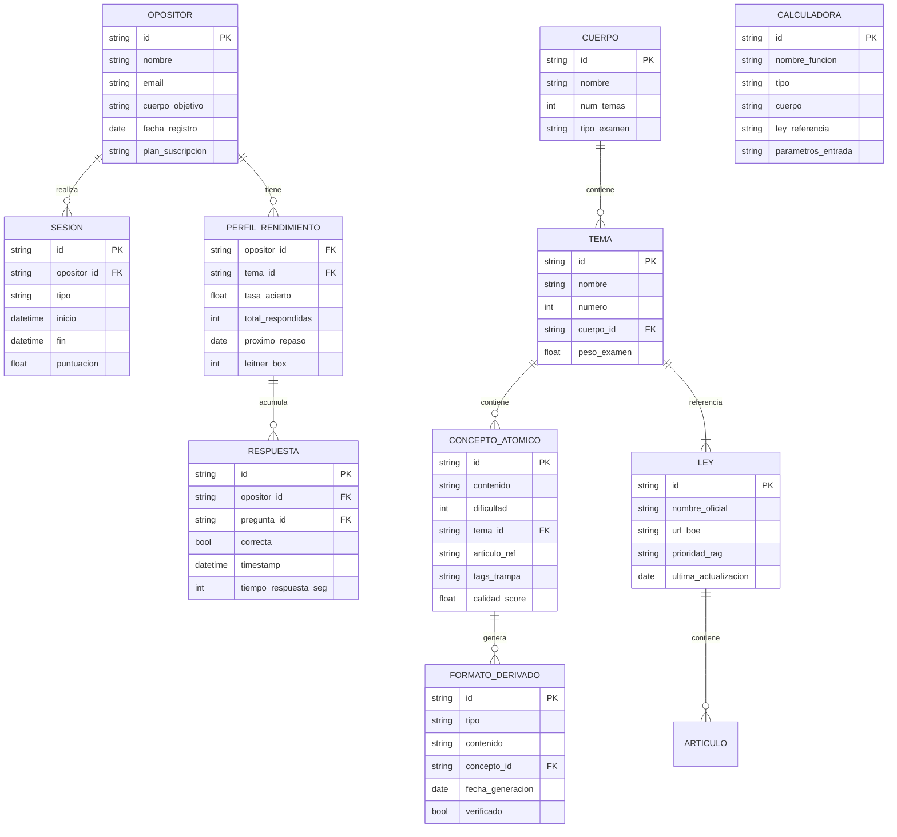

# Product Requirements Document — OpositAIA V2

**Autor:** Spas  
**Fecha:** 03/03/2026 · **Última actualización:** 01/05/2026  
**Versión:** 1.3 (addendum 01/05)  
**Estado:** ✅ Sincronizado — con addendum de cambios Mayo 2026  
**Product Brief:** [product-brief.md](file:///home/spas/OPOS_GEMINI_1/docs/product-brief.md)

---

> ## 🔄 ADDENDUM 21/05/2026 — LiteLLM, Content Gate, Caché Semántica y Dual Interface
>
> ### V14.5 y V17 — Aclaración de versiones internas
> - **V14.5 "Narrativa en Red"** = motor de generación de casos prácticos en `backend/v14/`. CaseSchemaBuilder + prose_validator + 10 blueprints activos (S02-S16). Genera redes de 3-8 personajes entrelazados. Pendientes: S17 (Mar/Minería), S18 (Cese RETA).
> - **V17** = `backend/scripts/ingest_neo4j_v17.py` — script de ingesta de leyes en Neo4j. Activo. 108 leyes, 6683 preceptos indexados.
>
> ### LiteLLM — Proxy Unificado (ampliación del addendum 01/05)
> El addendum 01/05 menciona LiteLLM solo como fallback. El diseño completo:
> - **LiteLLM como proxy entre backend y todos los modelos** (puerto 4000). Agentes nunca llaman directamente al proveedor.
> - **Modelo por tarea**: NEXO→Groq llama-4-scout (clasificación rápida), CHANDRA/VALERA/EXAMINER→Mistral medium (function calling), Verificación Tier 3→Claude Sonnet 4.6, TURCA/MEMO→Gemini Flash, Batch 54K preguntas→Groq (50% descuento).
> - **BMO selección de modelo**: BMO envía header `X-Model-Preference`. LiteLLM respeta la preferencia salvo que la tarea exija capacidad mínima (function calling, razonamiento legal).
> - **Fallback**: Mistral→Groq→DeepSeek. Nunca silencioso: si todo falla, error explícito al usuario.
> - **Cost tracking** por agente y por sesión. Budget alerts configurables.
>
> ### Content Quality Gate — CRÍTICO (nuevo, no estaba en el PRD)
> **Regla absoluta: el opositor nunca recibe contenido de zona draft.** Flujo obligatorio:
> ```
> LLM genera → confidence_scorer
>   > 0.85 → ZONA VERIFICADA → VerificadorBOE cruza con Neo4j → OK → ZONA PUBLICADA (wiki)
>   0.70-0.85 → retry automático (max 2 reintentos)
>   < 0.70 → descarta + alerta manual
> ```
> - **Frontend React**: accede SOLO a zona publicada y a respuestas en vivo con tools verificadas (calculadoras + Neo4j).
> - **BMO/Obsidian (Spas)**: acceso a zona draft + verificada para desarrollo y revisión.
> - **Implementación**: `backend/agents/content_gate.py` (por crear). Wraps todas las llamadas de generación.
> - **Motivación**: V14.5 ya demostró que el LLM inventa artículos (Art. 190.5 TRLGSS — no existe), plazos erróneos (19 semanas nacimiento), etc. El gate es la barrera entre lo que genera la IA y lo que estudia el opositor.
>
> ### Arquitectura de Caché y Ahorro de Tokens (nuevo §RNF-11)
> Jerarquía de resolución (0 tokens → máximo coste):
> 1. **Wiki Obsidian** (0 tokens) — nota verificada existente → servir directamente
> 2. **FAQ cache Redis** (0 tokens) — 100 top preguntas por tema, TTL 30 días
> 3. **Caché semántica Redis** (0 tokens) — cosine_similarity > 0.92 → reusar, TTL 7 días
> 4. **Caché exacta** (0 tokens) — hash MD5 de query normalizada, TTL 24h
> 5. **Neo4j lookup directo** (0 LLM tokens) — artículo exacto vía Cypher, número exacto vía calculadora
> 6. **LLM call** — solo para queries genuinamente nuevas → resultado se cachea y potencialmente publicado en wiki
> - **Estimación**: en fase madura, 70-80% de queries en niveles 1-4 (0 tokens LLM).
>
> ### Dual Interface — Frontend React + Obsidian (arquitectura formal)
> Dos interfaces, mismo backend, distintos niveles de acceso:
> - **Frontend React 19** (opositaia.com): opositor externo B2C. Auth Clerk + Stripe. Solo zona publicada.
> - **BMO Chandra Edition** (Obsidian): Spas + beta testers power users. Acceso draft + published. Desarrollo y validación.
> - **Wiki Obsidian** (`BOVEDA_OPOS`): fuente de verdad verificada. 249+ notas. Primera línea del sistema de caché (nivel 1). FAQ pre-renderizado como notas con `verificado: true`.
>
> ---
>
> ## 🔄 ADDENDUM 01/05/2026 — Chandra 7 Manos + Obsidian Integration
>
> El cuerpo del PRD sigue vigente. Estas son las **actualizaciones confirmadas** desde 17/04/2026:
>
> ### Chandra Agente Legal (NUEVO — no estaba en este PRD)
> - **Chandra es un agente legal de 7 herramientas** integrado en Obsidian vía BMO/Copilot
> - **7 herramientas:** tavily_search, search_boe, get_law_text_block, consultar_neo4j, calcular_ss, buscar_vault, **escribir_vault** (NUEVA 01/05/2026)
> - **Solución de red:** Backend movido a puerto 8080 para evitar ERR_CONNECTION_REFUSED en Windows/WSL2
> - **Alucinación temporal resuelta:** Inyección dinámica de fecha actual en system prompt (datetime.now())
> - **Integración Obsidian:** BMO Chatbot y Copilot conectados a Chandra vía http://127.0.0.1:8080/opos/v1
> - **Tool escribir_vault (01/05/2026):** Chandra puede crear notas automáticamente en el vault sin copiar/pegar manual
>
> ### LiteLLM Fallback Multi-Cloud (NUEVO — de implementation_plan.md.resolved)
> - **Resiliencia anti-bloqueos:** LiteLLM permite fallback automático entre Mistral → Gemini → Groq
> - **Groq modelos disponibles:** GPT OSS 120B, GPT OSS 20B, Llama 4 Scout, Qwen 3 32B (function calling + reasoning)
> - **Batch API Groq:** 50% descuento para procesamiento masivo (54K preguntas banco)
>
> ### Tauri Desktop App (NUEVO — de IDEAS_MAESTRAS_OPOSITAIA_2026.md.resolved)
> - **Empaquetado:** Frontend React + Backend Python (chandra.exe) usando Tauri + Sidecar
> - **BYOV (Bring Your Own Vault):** App distribuye limpia, usuario instala Obsidian + Vault ZIP por separado
>
> ---
>
> > ## 🔄 ADDENDUM 17/04/2026 — Cambios tras Marzo
> >
> > El cuerpo del PRD sigue vigente. Estas son las **actualizaciones confirmadas** desde que se escribió:
>
> ### Base de datos
> - **Neo4j ES LA base vectorial única**. Qdrant descartado (no aparece en roadmap actual).
> - Estado actual (19/05/2026): **108 leyes + 6.683 preceptos + 6.683 embeddings** (`pablosi/bge-m3-spa-law-qa-trained-2`).
> - **Louvain Community Detection:** 517 comunidades calculadas (Python networkx). Propiedad `communityId` en cada Precepto.
> - **Búsqueda híbrida nativa:** Vector HNSW + Fulltext spanish + Cypher graph traversal. NO necesita Qdrant.
> - **Multi-hop reasoning:** Chandra ya ejecuta Cypher multi-relación via `consultar_neo4j`.
> - MCP server propio (Node.js) en `/mcp-server/` expone 5 tools (search_rag, verify_boe, search_jurisprudence, generate_flashcards, get_law_summary).
>
> ### Calculadoras (§RF-01)
> - **Contador real: 60+** (no 55 ni 64). Grep confirma:
>   - `calculos_ss_extended.py`: 83KB, 30+ funciones (recargos, intereses, IT LO 1/2023, BR DT34, RDL 11/2024…)
>   - `calculadora_age.py`: 46KB, 30+ funciones (LPAC + TREBEP + Transversales)
> - **Trampas codificadas en docstrings** (G4, H7, I12, etc.) — la wiki las extraerá automáticamente.
> - Bugs corregidos: `PENSION_MAXIMA_JUBILACION=3359.60` (era 3175.04), `SMI_2026=1221.00` (era 1184.00).
>
> ### V14.5 "Narrativa en Red" (NUEVO — no estaba en este PRD)
> - Arquitectura `CaseSchemaBuilder` + `prose_validator.py` + `cambios_dm_2026.py`.
> - 10 blueprints activos (S02-S16). Pendientes: S17, S18.
> - `backend/v14/` incluye `nombres_pool.py` para generar personajes propios.
> - Gap detectado vs DM real: necesita **red de 3-8 personajes con parentescos** (ver `/ANALISIS_SOFISTICACION_DM_VS_V14.md`).
>
> ### Trampas catalogadas
> - **~100 trampas activas** en `catalogo_trampas.yaml` + `catalogo_trampas_adicional.yaml` (categorías A-T).
> - Incluye R (RETA), S (Sistemas Especiales), T (Cese Actividad).
>
> ### Plan Maestro Simulacros
> - `/academias/1_casos_recientes_2026_DM/PLAN_MAESTRO_CASOS_SIMULACROS.md` v4 (30/03/2026, 1157 líneas).
> - Banco objetivo: **8.000-10.000 preguntas** (revisado a la baja desde los 54K originales del §5).
> - Gaps identificados: TREBEP, LPAC, LRJSP, LCSP infrarrepresentados.
>
> ### Salamandra (R1 local)
> - **DESCARTADA** para producción (por lentitud y resultados inconsistentes). Se mantiene `salamandra_client.py` solo como referencia.
>
> ### Nuevo pilar — Obsidian Wiki (NO estaba en el PRD)
> - Vault markdown en `/home/spas/OPOS_GEMINI_1/BOVEDA_OPOS_SS/` como **complemento de estudio** del opositor y extractor de conocimiento.
> - Sincronización con Syncthing (gratis, ya instalado).
> - **No sustituye el frontend React**. Docs de estrategia:
>   - `/17_04_26_ESTRATEGIA_EXTRACCION_SABIDURIA.md`
>   - `/academias/1_casos_recientes_2026_DM/temario_troceado/PLAN_CLD+_OBCIDIAN_AL.md` v3
>
> ### Nuevas Defensas Operativas (Añadidas 24/04/2026)
> - **Escalado RAM y Caché Vectorial**: Se pre-generarán los vectores de las preguntas estáticas y trampas COSMIC para evitar saturar la CPU de Neo4j en cálculos semánticos en vivo durante picos de concurrencia.
> - **Embudos Webhook Asíncronos**: Implementación de colas de tareas (Buzón de cartas / Background Tasks en FastAPI) para aislar operaciones críticas de estado (como ingresos de Stripe), asegurando tolerancia a fallos frente a reinicios de DB.
>
> ### Secciones del PRD que siguen 100% vigentes
> §2 Criterios de Éxito · §3 User Journeys · §5 Innovación (COSMIC + Motor Determinístico + Repetición Espaciada) · §6 Tipo Proyecto · §8 RF · §9 RNF · §11 Verificación.
>
> ### Secciones que necesitan actualización futura (no urgente)
> §4 Modelo de Dominio (añadir entidades `Trampa`, `PatronDM`, `NotaWiki`) · §7 Scoping (añadir Fase 1.5 "Wiki Viva") · §10 Stack (eliminar Qdrant, confirmar Neo4j).

---

## 1. Resumen Ejecutivo

**OpositAIA** es una plataforma de preparación para oposiciones AGE y SS que combina inteligencia artificial, un motor de cálculos legales determinístico (Python) y contenido verificado contra el BOE para ofrecer estudio adaptativo personalizado. OFRECE MAPAS MENTALES SIMULACROS CASOS PRACTICOS IA PATA RESOLVER DUDAS, FLASHCARDS Y PLAN DE STUDIO ADAPTATIVO, SEGUIMIENTO DE PROGRESO, RECOMENDACIONES WHAT NEXT, HISTORIAS INTERACTIVAS TIPO JUEGO "CONQUISTA TU PALZA".

### Problema

Los opositores enfrentan:
- **Material desactualizado** — Las leyes cambian frecuentemente y los manuales no se actualizan al mismo ritmo CON LAS FECHAS DE CORTE!
- **Casos prácticos sin feedback** — No hay herramienta que resuelva cálculos de SS/AGE paso a paso con artículos citados
- **Estudio no personalizado** — Sin sistema que se adapte a las debilidades individuales del opositor
- **Coste elevado** — Las academias cobran €200-400/mes por contenido genérico

### Solución

Una plataforma donde:
1. Un **LLM jamás calcula** — Extrae parámetros del enunciado, ejecuta la función Python, narra el resultado con el artículo citado
2. Todo el contenido se verifica contra **RAG legal** (NEO4J + BOE MCP)
3. El estudio se adapta al opositor con **repetición espaciada** y perfil de rendimiento
4. Modelo de contenido **COSMIC** — 1 concepto → 6+ formatos automáticamente

### Decisiones del Product Owner

| # | Decisión | Respuesta |
|---|---|---|
| 1 | Roadmap | ✅ 3 fases confirmadas |
| 2 | Neo4j | ✅ Local Docker primero |
| 3 | Scope inicial | ✅ **C1 Administrativo SS** primero, expandir después |
| 4 | Precios | ✅ **Trial €1/3 días + Pro €69/mes** |
| 5 | Foro | ✅ Post-E2E y despliegue |
| 6 | Mercado | ✅ **B2C primero** (B2B con academias más adelante) |

---

## 2. Criterios de Éxito

| Métrica | Fase 1 | Fase 3 |
|---|---|---|
| Precisión calculadoras | 100% | 100% |
| Cobertura normativa RAG | 100% leyes CRÍTICAS | 100% temario |
| Preguntas verificadas en banco | 5.000 | 54.000 |
| Usuarios registrados | 10 beta testers | 1.000 |
| Retención semanal | 70% | 90% |
| NPS | >50 | >70 |
| MRR | €100 | €5.000 |

---

## 3. User Journeys

### Journey 1: Opositor practica caso práctico SS

```
María (C1 SS) abre la app → Selecciona "Caso Práctico" → Elige tema "Jubilación"(A LO MEJOR NO ELIGE, SERVIMOS NOSTROS, 20 CASO POR SEMANA 1 SIMULACRO ENTERO POR SEMANA Y 2 TESTS CADA DIA, LIMITE DE PREGUNTAS A LA IA ETC.)
→ App genera caso con datos parametrizados (edad, cotización, bases) O SIRVE CASO ENSAMBLADO YA
→ María intenta resolverlo → Envía su respuesta
→ Calculator Agent ejecuta calcular_jubilacion() con los parámetros
→ Verify Agent contrasta con artículos TRLGSS
→ App muestra: resultado exacto + pasos + artículos citados + dónde erró María
→ Pregunta se marca en el perfil → Repetición espaciada la reprogramará 
```

### Journey 2: Opositor estudia con flashcards adaptativas

```
María abre "Repaso" → Sistema selecciona 20 flashcards CON GAPS HUECOS!! priorizando:
  - Conceptos fallados recientemente (Leitner box 1)
  - Temas con peso alto en examen pero rendimiento bajo
→ Por cada flashcard: concepto → respuesta → autoevaluación (fácil/difícil/no sé)
→ Algoritmo SM-2 recalcula intervalos
→ Al terminar(SOLO SI LO PIDE ELLA): resumen de progreso O DIAGRAMA + siguientes recomendaciones
```

### Journey 3: Opositor realiza simulacro cronometrado

```
María selecciona "Simulacro C1 SS" O "TEST 20 PREGUNTAS SIN TIEMPO" → 70 preguntas tipo test + 60 minutos
→ Preguntas extraídas del banco verificado (dificultad adaptada al perfil)
→ Temporizador visible + progreso
→ Al terminar: nota + percentil + análisis por tema + errores con explicación
→ Temas débiles se refuerzan automáticamente en siguientes sesiones
```

### Journey 4: Opositor hace pregunta libre al chat, QUE ESTA AL TANTO DE LO QUE HA TRABAJADO mARIA ULTIMAMENTE, Y LE PREGUNTA "¿QUIERES TRABAJAR X O Y?"

```
María escribe: "¿Cuánto cobra de jubilación alguien con 38 años cotizados y base reguladora de 2.100€?"
→ Intent Agent clasifica: cálculo_ss / jubilación
→ Calculator Agent ejecuta calcular_jubilacion(años=38, base=2100)
→ Chat responde: "Según art. 210 TRLGSS, con 38 años cotizados el % es 100%.
   Pensión mensual = 2.100,00 € (14 pagas). Nota: verificar tope máximo 2026."
→ Si María pregunta "¿y si tuviera 35 años?" → recalcula automáticamente
```

---

## 4. Modelo de Dominio



### Tipos enumerados clave

| Tipo | Valores |
|---|---|
| `cuerpo` | `C2_AUX_AGE`, `C1_ADM_AGE`, `C1_ADM_SS`, `A2_GESTION_SS` |
| `tipo_formato` | `test`, `flashcard`, `mapa_mental`, `caso_practico`, `esquema`, `mnemotecnia` |
| `tipo_calculadora` | `ss_contributiva`, `ss_no_contributiva`, `age_lpac`, `age_trebep`, `age_transversal` ETC. |
| `tipo_sesion` | `simulacro`, `repaso_espaciado`, `caso_practico`, `chat_libre`, `flashcards` |
| `plan` | `trial`, `pro` |

---

## 5. Innovación y Diferenciación

### 5.1 Motor Determinístico (Zero Hallucination Engine)

A diferencia de cualquier otra plataforma que usa LLMs para responder preguntas legales, OpositAIA garantiza **cero alucinaciones numéricas O LEGALES**:

- **55 calculadoras Python** con `Decimal` para precisión exacta
- El LLM **NUNCA** genera números: extrae parámetros → ejecuta función → narra resultado
- Cada resultado incluye el **artículo de ley citado** (verificable contra BOE)
- Si no existe calculadora para un cálculo específico → la app dice "no puedo calcular esto automáticamente" en vez de !!!

### 5.2 COSMIC: Create Once, Serve Many

Modelo de contenido donde **1 concepto atómico genera 6+ formatos** automáticamente:
- Test tipo examen → Flashcard → Mapa mental → Caso práctico → Esquema → Mnemotecnia
- Reduce coste de generación a ~€0 por formato derivado
- Calidad garantizada por pipeline de verificación (Verify Agent)

### 5.3 Repetición Espaciada Inteligente

Combinación de algoritmos Leitner y SM-2 adaptados al contexto de oposiciones:
- **5 cajas Leitner** con intervalos progresivos (1d → 3d → 7d → 14d → 30d)
- Priorización por **peso en examen** × **debilidad del opositor**
- Integración con perfil adaptativo para recomendar sesiones óptimas

---

## 6. Tipo de Proyecto

**Brownfield** — Existe un MVP funcional con:
- Backend FastAPI (9 routers, Docker Compose)
- 28 calculadoras SS operativas
- Qdrant RAG con 48.866 chunks
-ACTUAL NEO4J CON 102 LEYES
- Frontend React 19 con chat, progreso, generador de casos
- MCP Server con 9 tools
- 25 agentes diseñados (parcialmente operativos)

La evolución V2 **reutiliza** toda esta infraestructura y ha completado las capas críticas (64 calculadoras, COSMIC, sistema de agentes).

---

## 7. Scoping — Fase 1: Consolidación (C1 SS)

> [!IMPORTANT]
> Scope inicial limitado a **C1 Administrativo SS**. Los demás cuerpos se añaden en Fase 3.

### In Scope (Fase 1)

| Funcionalidad | Prioridad | Estado brownfield |
|---|---|---|
| 33 calculadoras AGE (`calculadora_age.py`) | 🔴 CRÍTICA | ✅ IMPLEMENTADO (100%) |
| RAG expandido (TRLGSS + Código 442) | 🔴 CRÍTICA | ✅ COMPLETADO |
| Simulacros cronometrados C1 SS | 🔴 CRÍTICA | ✅ IMPLEMENTADO |
| Autenticación Clerk | 🟠 ALTA | ❌DESACRTADO POR AHORA!
| Migración localStorage → PostgreSQL | 🟠 ALTA | ⚠️ Schema existe, poco uso real, pospuesta! |
| Tests automatizados calculadoras | 🟠 ALTA | FUNCIONAL Y MAS EN EL ARCHIVO.MD DE FLUJO O MEMORY MCP EL GRAFO |

### In Scope (Fase 2)

| Funcionalidad | Prioridad |
|---|---|
| Neo4j local Docker (grafo COSMIC) | 🟠 ALTA |
| Pipeline COSMIC (1→6 formatos) | 🟠 ALTA |
| Repetición espaciada (Leitner/SM-2) | 🟠 ALTA |
| Banco 10K preguntas verificadas | 🟠 ALTA |
| Perfil adaptativo opositor | 🟠 ALTA |
| Sistema agentes orquestados | 🟠 ALTA |

### In Scope (Fase 3)

| Funcionalidad | Prioridad |
|---|---|
| Stripe (Trial €1/3d UN SIMULACRO, 3 TESTS 3 CASOS PRACTICOS Y SOLO UN POCO DE CHAT PARA DUDAS + Pro €69/mes) COMPLETO| 🔴 CRÍTICA |
| PWA / modo offline | 🟡 MEDIA |
| Mini-foro (post-E2E) | 🟡 MEDIA |
| Psicotécnicos | 🟡 MEDIA, DESCARTADO POR AHAORA |
| Analytics predictivo | 🟢 BAJA |
| Expansión a C2, C1 AGE, A2 SS | 🟡 MEDIA |
|JUEGO INTERACTIVO CONQUISTA TU PLAZA ! MEDIA
### Out of Scope (V2)

- Dashboard de academia / reportes por alumno
- API pública para academias (B2B)
- Kits de contenido descargable
- Fine-tuning de modelos propios
- App nativa iOS/Android
- Gamificación competitiva (rankings entre usuarios)
- Memes educativos con IA- PARA VENDER KITS POR AHORA

---

## 8. Requisitos Funcionales

### RF-01: Motor de Calculadoras

| ID | Requisito | Criterio de Aceptación |
|---|---|---|
| RF-01.1 | 27 calculadoras SS operativas | ✅ Ya implementado — Todos los cálculos devuelven resultado con `Decimal` |
| RF-01.2 | IMV como módulo independiente | ✅ Ya implementado — `calculos_imv.py` operativo |
| RF-01.3 | 28 calculadoras AGE procedimentales | LPAC (18) + TREBEP (7) + Transversales (3), cada una con función Python, parámetros tipados y artículo citado |
| RF-01.4 | El LLM nunca calcula directamente | Si un usuario pregunta un cálculo, el LLM extrae los parámetros, llama a la calculadora Python, y narra el resultado. Si no existe calculadora → responde "no puedo calcular esto automáticamente" |
| RF-01.5 | Valores actualizados 2026 03.04.2026 + EXEPCIONES RETROACTIVOS| IPREM, SMI, topes cotización, pensiones mínimas actualizados a RDL vigente |
HAY TABLA EN NEO4J DE CANTIDADES CORRECTAS!
### RF-02: RAG Legal

| ID | Requisito | Criterio de Aceptación |
|---|---|---|
| RF-02.1 | Indexación Códigos Electrónicos BOE | Código 442 (C1 AGE) + TRLGSS consolidado indexados en NEO4J con chunking semántico PARA ARTICULOS LARGOS Y VECTORES |
| RF-02.2 | 54 normas identificadas con prioridad | Cada norma tiene prioridad CRÍTICO/ALTA/MEDIA/BAJA según frecuencia en exámenes 2020-2025 | POR IMPLENMENTAR!!!
| RF-02.3 | Verificación vigencia en tiempo real | Al citar un artículo, verificar contra BOE XML API que sigue vigente |
| RF-02.4 | MUFACE/MUGEJU/ISFAS como concepto | Solo RAG conceptual (quiénes pertenecen, diferencias), sin calculadoras |
| RF-02.5 | MCP pipeline de ingestion | ✅ Ya implementado — SCTIPT . V 14.5 PARA CREACION Y V17 PARAB INGESTA EN NEO4J operativos|

### RF-03: Generación de Contenido COSMIC

| ID | Requisito | Criterio de Aceptación |
|---|---|---|
| RF-03.1 | Concepto atómico con metadata | Cada concepto tiene: id, cuerpo[], tema, ley, artículo, dificultad (1-5), tags_trampa[] | y mas todavia , wiki etc. 
| RF-03.2 | 6 formatos derivados automáticos | A partir de 1 átomo: test + flashcard + mapa mental + caso práctico + esquema + mnemotecnia |
| RF-03.3 | Verificación automática | Verify Agent contrasta cada derivado contra RAG antes de servir al usuario |
| RF-03.4 | Almacenamiento en Neo4j | Relaciones concepto→ley→artículo→pregunta en grafo navegable y mas relaciones|

### RF-04: Estudio Adaptativo

| ID | Requisito | Criterio de Aceptación |
|---|---|---|
| RF-04.1 | Repetición espaciada | Algoritmo Leitner con 5 cajas: 1d, 3d, 7d, 14d, 30d. Si falla → vuelve a caja 1 |
| RF-04.2 | Perfil de rendimiento | Tasa de acierto por tema, historial de respuestas, tiempo medio |
| RF-04.3 | Simulacros cronometrados | 70 preguntas test patre 1 + 3 reserva y 60 minutos mas caso practico 15 preguntas + 3 de reserva. Resultado con nota, percentil y análisis por tema |
| RF-04.4 | Plan de estudio dinámico | Prioriza temas con: (menor rendimiento × mayor peso examen) |

### RF-05: Autenticación y Pagos

| ID | Requisito | Criterio de Aceptación |
|---|---|---|
| RF-05.1 | Registro/login con Clerk | SSO, magic links, 10K MAU free tier |
| RF-05.2 | Trial €1 / 3 días | Pago único €1 vía Stripe, acceso completo con límites durante 3 días |
| RF-05.3 | Suscripción Pro €69/mes | Pago recurrente Stripe, acceso ilimitado a todas las funcionalidades | pago de 3, 6 o 12 meses con descuento, un mes sin descuento
| RF-05.4 | Gestión de suscripción | Cancelar, pausar, cambiar plan desde perfil de usuario |

### RF-06: Chat Inteligente

| ID | Requisito | Criterio de Aceptación |
|---|---|---|
| RF-06.1 | Multi-modelo | ✅ Ya implementado parcialmente — Groq, DeepSeek, Gemini, Ollama, Mistral, claude, greok |
| RF-06.2 | Routing por intent | Intent Agent clasifica: conceptual / cálculo_ss / cálculo_age / simulacro / flashcard |
| RF-06.3 | Citación legal | Cada respuesta cita artículos relevantes con enlace al BOE |
| RF-06.4 | Contexto de conversación | Mantiene historial de la sesión para preguntas de seguimiento |

### RF-07: Mini-Foro Comunitario (Fase 3, post-E2E)

| ID | Requisito | Criterio de Aceptación |
|---|---|---|
| RF-07.1 | Hilos por tema/cuerpo | Usuarios pueden abrir hilos organizados por tema del temario |
| RF-07.2 | Moderación básica | Reportar contenido, bloquear usuarios, reglas comunitarias |
| RF-07.3 | Solo para Pro | Acceso exclusivo para suscriptores Pro | no decidido del todo, a lo mejor compartir wiki-opos basta!!!

---

## 9. Requisitos No Funcionales

| ID | Categoría | Requisito | Métrica |
|---|---|---|---|
| RNF-01 | **Rendimiento** | Respuesta del chat < 3s (caché) / < 8s (sin caché) | P95 latencia |
| RNF-02 | **Rendimiento** | Cálculo de calculadora < 50ms | P99 latencia |
| RNF-03 | **Disponibilidad** | Uptime 99.5% | Mensual |
| RNF-04 | **Seguridad** | RGPD compliant (datos en EU) | Fly.io Frankfurt + Mistral EU | u otros , claudflare etc. headles etc ya veremos el despliegue!! hay mas opciones AWS etc. NEOX etc. 
| RNF-05 | **Seguridad** | API keys nunca expuestas en frontend | Server-side proxy obligatorio |+ anti hacking fishing etc. medidas, ni investigado!
| RNF-06 | **Escalabilidad** | Soportar 100 usuarios concurrentes en Fase 1 | Load test |
| RNF-07 | **Precisión** | 0 errores numéricos en calculadoras | 100% test coverage |
| RNF-08 | **Accesibilidad** | WCAG 2.1 AA mínimo | Audit automático |
| RNF-09 | **Offline** | PWA funcional sin conexión (Fase 3) | Service Worker + caché |
| RNF-10 | **Backup** | Backup diario PostgreSQL + neo4j + wiki + historial | Automatizado |

---

## 10. Stack Tecnológico

### Mantener (brownfield)
- **Backend:** FastAPI 0.115 + Python 3.11
- **Frontend:** React 19 + Vite + TypeScript
- **Base de datos:** PostgreSQL 15 + Qdrant 1.12, dicker, neo4j, obsidian, plugins, excalidraw y anki
- **Infraestructura:** Docker Compose
- **LLMs:** Claude, Groq, DeepSeek V3, Gemini, Ollama, llama 4, Grok, Mistral + más

### Añadir
- **Neo4j Community** — Grafo COSMIC (local en Docker, decisión PO)
- **Redis** — Caché semántico + rate limiting + sesiones por decidir!!!
- **Clerk** — Autenticación por decidir!!
- **Stripe** — Pagos (Trial + Pro)por decidir!!
- **Mistral API** — Nemo (clasificación), Large (verificación legal), OCR (PDFs) por decidir!!
- **Cloudflare Pages** — Frontend CDN por decidir!! 

### Infraestructura
- **Desarrollo:** Docker Compose local (Postgres + Qdrant + Neo4j + Redis + Backend + obcidian + anki)
- **Producción:** Fly.io Frankfurt + Cloudflare Pages + Neo4j local VPS + Qdrant Cloud Free o neo4j por 5 € al mes

---

## 11. Verificación

### Tests Automatizados
- **Calculadoras:** 100% coverage con pytest — cada función contra caso real de examen
- **RAG:** Tests de búsqueda semántica con queries reales de opositores
- **Agentes:** Tests de pipeline end-to-end (petición → respuesta con citas etc. wiki )
- **Frontend:** Playwright E2E para flujos críticos (login → simulacro → resultado)
al final
- **tests de estres, ataque , vulnerabilidades**
### Validación Manual
- **10 beta testers** (opositores reales C1 SS) durante 2 semanas
- **Contraste con exámenes oficiales** 2024-2025 para las calculadoras
- **Revisión legal** de contenido generado por COSMIC antes de publicar de preparador bueno de opos! 

---

*Generado a partir de: [product-brief.md](file:///home/spas/OPOS_GEMINI_1/docs/product-brief.md), Plan Cósmico Maestro, Apéndices II-VIII, Auditoría Brownfield 27/02/2026, Brainstorming 12/2025.*

---

## 💡 IDEAS GEMINI 3.1 BRAINSTORMING + Elicitación (Abril 2026)

Esta sección recopila las defensas operativas, arquitectónicas y estrategias de producto derivadas de las sesiones de "Red Team" y Elicitación de abril.

### 1. El Dilema del Vault vs React App (Estrategia B2C de Entrega)
*   **La Web Nativa (React 19):** Al contar ya con un frontend robusto (`ChatView`, `MockExamView`, etc.), la Wiki/Grafo de progreso se servirá nativamente online. Cero fricción, 100% control, y posibilidad de monetizar 69€/mes sin agobiar a usuarios no técnicos. 
*   **Aislamiento B2C (Multi-tenant en Neo4j):** Los usuarios podrán subir sus PDFs. El backend generará vectores etiquetados con `propietario: "Spas_123"`. El RAG filtrará nodos "Oficiales" OR "Pertenecientes a Spas_123".

### 2. Infraestructura y Tolerancia a Fallos
*   **Neo4j y Costes:** En lugar de lanzar Cosine Similarity en tiempo real bajo cargas pesadas, se pre-generan y cachean los vectores fijos de las 10,000 preguntas. Coste de VPS estimado: <15€/mes (8GB RAM).
*   **Colas Asíncronas (Embudos Webhook):** Stripe y otras dependencias críticas usarán "Buzones de Cartas" asíncronos en FastAPI (`Background Tasks`). Evitará pérdida de estados de permisos VIP por bloqueos temporales de DB.

### 3. Seguridad Anti-Piratería y Account Sharing
*   Si se explora la vía del "Cliente Obsidian Configurado" o accesos API, se dotará a cada usuario de una **License Key**.
*   Baneo local estricto si una API Key reporta IPs concurrentes dispares (freno inmediato al *account sharing* de academias fraudulentas).
*   Se evitan fugas masivas (Prompt Injections de "Dámelo todo") restringiendo los enpoints de `mcp_gateway.py` a porciones o contextos RAG estrictos. 

### 4. Seguimiento de Progreso Interconectado (Orquestador Neo4j)
*   **El Motor Algorítmico:** Neo4j conectará al `(Usuario)` con la `(Trampa)` mediante relaciones de `[ESTUDIÓ]`.
*   Propiedades: `tasa_acierto`, `leitner_box`, `siguiente_repaso_recomendado`.
*   **Ensamblado Dinámico:** Al pedir estudiar, FastAPI consultará a Neo4j qué conceptos exactos fallan más, pasándoselos al motor COSMIC para fabricar al instante casos prácticos mixtos y flashcards **justo en el punto de dolor del opositor**.

### 5. Mitigación Estricta de Alucinaciones Causales
Todo el ecosistema de generación narrativa se blinda mediante las propuestas detalladas en:  
🔗 **[24_04_26_CABRON_GEMINI_IDEA.md](file:///home/spas/OPOS_GEMINI_1/24_04_26_CABRON_GEMINI_IDEA.md)**
*   _Rationale Obligatorio:_ Las deducciones jurídicas emanan de Python y se prohíbe al LLM inventarlas.
*   _Patcher Autónomo:_ Bucle de refactorización quirúrgica sobre párrafos, sin tirar el borrador completo.
*   _RAG Inverso Estricto:_ El System Prompt del escritor siempre incluirá el articulado literal.

### 6. Obsidian como "Motor Híbrido" (Zettelkasten + Canvas)
En lugar de saturar Obsidian con todo el BOE (que vive en Neo4j), se sigue el plan **[18_04_26_ESTRATEGIA_EXTRACCION_SABIDURIA_v1.2]**:
*   Solo el **núcleo de sabiduría** (43 notas base, 15 preceptos troncales y las trampas radiadoras) va al `.md`. Las leyes puras y duras se consultan a Neo4j mediante la API (`mcp_gateway.py`).
*   **Aprovechamiento del Obsidian Canvas:** ¿Para qué sirve en OpositAIA? Para mapear procesos visuales de la ley. Se usa el Canvas para que el opositor arrastre nodos de "Trampas" y los hilvane, dibujando, por ejemplo, el Timeline de los grados de incapacidad conectando flechas entre notas de texto atómicas.
*   Conecta además con la **[21_04_2026_PLAN_SERIE_TURCA]**: La "Capa Narrativa" (los personajes como Darío o Amparo) vive conectada mediante wikilinks a la "Capa Técnica", dando vida legal al grafo de Obsidian.

### 7. Estrategia Comercial de Vaults (El Segundo Cerebro)
Se plantean dos opciones de venta directas (framework en `.zip` preconfigurado con plugins de IA y Prompts inyectados, sin código):
1.  **"EscritorAIA Vault":** Un Vault para novelistas/escritores (ej. la novela en curso). Viene enlazado con IAs locales. El usuario usa el chat embebido para revisar "fallos narrativos y continuidad" (haciendo RAG de todo su borrador automáticamente).
2.  **"OpositAIA Vault Premium":** La vía *hardcore* del opositor de SS. Plantilla descargable conectada a través de *License Keys* a nuestra API REST en la nube (FastAPI/Neo4j). Se benefician de su ecosistema local y plugins tipo "Spaced Repetition", pero consumiendo la Inteligencia Artificial calibrada en nuestro modelo central.
